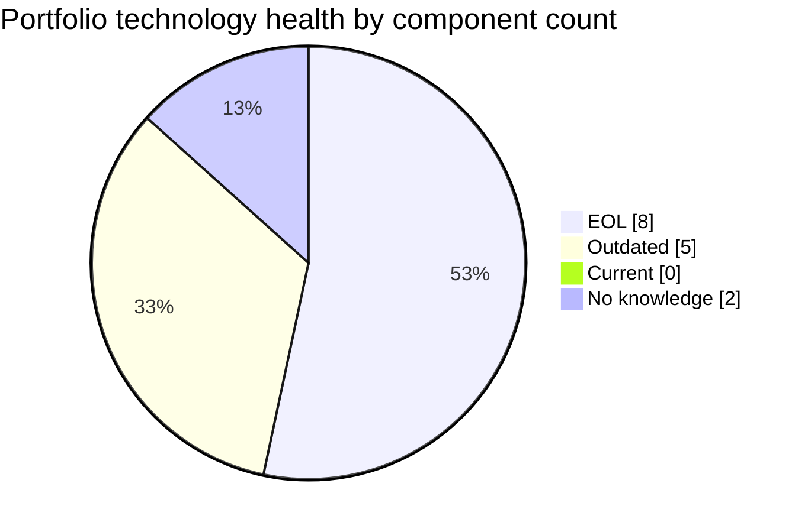
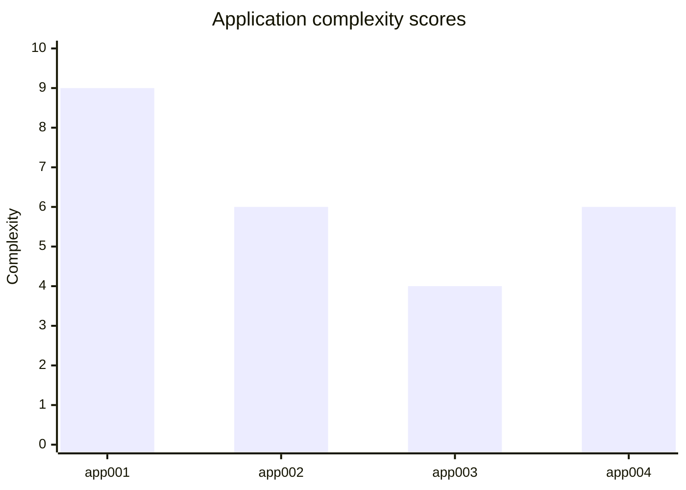
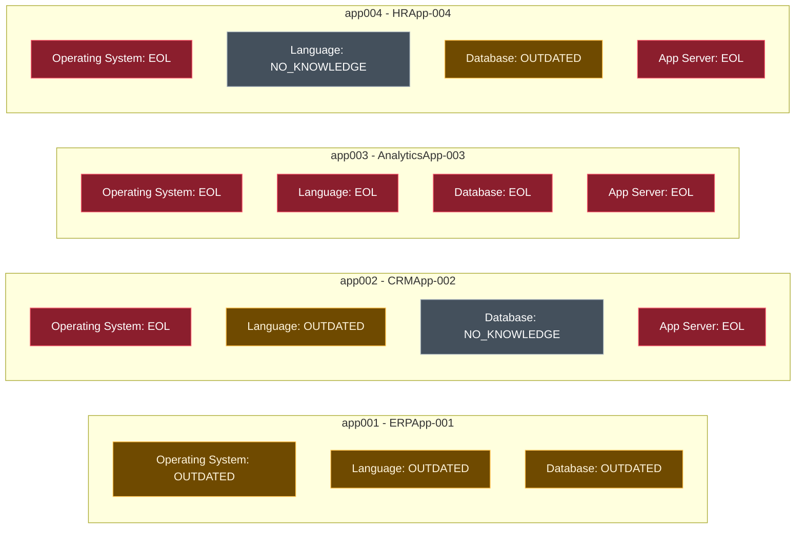

# Portfolio Modernization Report

Application modernization with Agentic AI powered by Capgemini GenSuite.

- **Assessment date:** 2026-07-14
- **Analysis ID:** `PORT-CBEFD63610D9`
- **Portfolio size:** 5 applications total
- **In scope:** 4 applications
- **Out of scope:** 1 retired application (`app005`)

## Executive Summary

The portfolio contains **4 in-scope production applications** across Finance, Marketing, IT, and HR. The estate is materially burdened by legacy technology: **8 of 15 assessed components are EOL**, **5 are outdated**, and **2 cannot be fully assessed because version data is missing**. Only app003 is low-complexity enough to execute as a rapid full-stack refresh; app001 and app004 require strategic, multi-wave modernization programs due to business criticality and platform coupling.

The **quantified modernization investment** across applicable scenarios is **$1,019,950**, with **$1,663,200** in modeled three-year savings, producing a **portfolio ROI of 63.1%**. These totals exclude the `update_outdated_components` scenario because no standard finance model was provided for that scenario.

## Portfolio Health Overview

- Applications total: **5**
- Applications in scope: **4**
- Retired / out of scope: **1**
- Assessed technology components: **15**
- EOL components: **8**
- Outdated components: **5**
- Current components: **0**
- No-knowledge components: **2**

```mermaid
xychart-beta
    title "Quantified business case by application"
    x-axis [app001, app002, app003, app004]
    y-axis "USD" 0 --> 628650
    bar [436950, 11000, 271000, 301000]
    bar [536700, 37500, 517500, 571500]
```

### Technology status matrix

| Application | OS | Language | Database | App Server |
|---|---|---|---|---|
| app001 | OUTDATED | OUTDATED | OUTDATED | NOT_APPLICABLE |
| app002 | EOL | OUTDATED | NO_KNOWLEDGE | EOL |
| app003 | EOL | EOL | EOL | EOL |
| app004 | EOL | NO_KNOWLEDGE | OUTDATED | EOL |

## Portfolio-Level Scenario Summary

| Scenario | Fulfilled | Partially Fulfilled | Applicable | Blocked | Not Applicable | Lack of Data |
|---|---:|---:|---:|---:|---:|---:|
| OS Update / Security Patch | 0 | 0 | 4 | 0 | 0 | 0 |
| Switch to Standard Linux OS | 2 | 0 | 1 | 0 | 1 | 0 |
| Switch to ARM CPU | 0 | 0 | 0 | 2 | 0 | 2 |
| Application Server Replacement | 0 | 0 | 3 | 0 | 1 | 0 |
| Deploy to Public Cloud | 2 | 1 | 1 | 0 | 0 | 0 |
| Application Containerization | 2 | 0 | 0 | 2 | 0 | 0 |
| Application Refactor / Decoupling | 0 | 0 | 3 | 0 | 1 | 0 |
| Upgrade Legacy Databases | 0 | 0 | 3 | 0 | 0 | 1 |
| Switch DB Engine to Open Source | 2 | 1 | 1 | 0 | 0 | 0 |
| Update Outdated Components | 0 | 0 | 4 | 0 | 0 | 0 |

## Portfolio-Level Business Case Summary

| Metric | Value |
|---|---:|
| Quantified investment required | $1,019,950 |
| Quantified 3-year savings | $1,663,200 |
| Portfolio ROI | 63.1% |
| Unquantified scenarios | `update_outdated_components` for all 4 in-scope apps |

### Application ranking by quantified ROI

| Rank | Application | Complexity | Investment | 3-Year Savings | ROI |
|---|---|---:|---:|---:|---:|
| 1 | app002 (CRMApp-002) | 6 | $11,000 | $37,500 | 240.9% |
| 2 | app003 (AnalyticsApp-003) | 4 | $271,000 | $517,500 | 91.0% |
| 3 | app004 (HRApp-004) | 6 | $301,000 | $571,500 | 89.9% |
| 4 | app001 (ERPApp-001) | 9 | $436,950 | $536,700 | 22.8% |

## app001 — ERPApp-001

**Business context:** Core ERP system handling financial transactions, general ledger, and regulatory reporting

- **Business unit:** Finance
- **Criticality:** High
- **Solution type:** Custom made
- **Deployment:** On-Premise
- **Architecture:** 1-Tier
- **Containerized:** No
- **CI/CD present:** No
- **Users:** 350
- **Interfaces / APIs:** 5 external interfaces / 0 APIs
- **Hosting footprint:** 2 environments, servers sv01, sv02

### Technology Assessment

| Component | Value | Status | Reason |
|---|---|---|---|
| Operating System | AIX 7.2 | OUTDATED | IBM standard support ended on 2025-04-30; only extended support continues until 2027-04-30. |
| Programming Language | COBOL-2014 | OUTDATED | The ISO standard remains implementable but is a legacy language with shrinking talent availability and high modernization friction. |
| Database | Oracle 19c | OUTDATED | Premier Support ended on 2024-04-30 and the release is now in Extended Support until 2027-04-30. |
| Application Server | None | NOT_APPLICABLE | No application server is recorded for this 1-tier application. |

- **Status counts:** EOL 0, OUTDATED 3, CURRENT 0, NO_KNOWLEDGE 0

### Complexity Assessment

- **Score:** 9 / 10
- **Cost multiplier:** 1.5x
- **Rationale:** COBOL on AIX, 1-tier ERP monolith, five external interfaces, no CI/CD, licensed Oracle database, and on-premise-only hosting drive high transformation difficulty.

### Scenario Applicability

| Scenario | Status | Assessment |
|---|---|---|
| OS Update / Security Patch | APPLICABLE | Aging AIX requires patch and support review to reduce operational and compliance risk. |
| Switch to Standard Linux OS | APPLICABLE | AIX is a proprietary Unix platform and a long-term migration target, but it requires runtime decoupling first. |
| Switch to ARM CPU | BLOCKED | Blocked by legacy AIX and COBOL runtime dependencies. |
| Application Server Replacement | NOT_APPLICABLE | No application server is present. |
| Deploy to Public Cloud | APPLICABLE | Feasible as a strategic program, although complexity is high because the ERP stack is tightly coupled to legacy runtime assumptions. |
| Application Containerization | BLOCKED | Blocked by the AIX legacy Unix estate. |
| Application Refactor / Decoupling | APPLICABLE | Strong candidate because the 1-tier COBOL monolith constrains agility, scalability, and integration patterns. |
| Upgrade Legacy Databases | APPLICABLE | Oracle 19c should be upgraded or re-platformed before support windows narrow further. |
| Switch DB Engine to Open Source | PARTIALLY_FULFILLED | Can reduce license cost, but ERP data semantics and migration effort make this a risk-managed step rather than a quick win. |
| Update Outdated Components | APPLICABLE | Legacy language and platform components should be modernized, but no standard finance model is available. |

### Business Case

| Scenario | Status | Investment | Annual Savings | 3-Year Savings | ROI |
|---|---|---:|---:|---:|---:|
| OS Update / Security Patch | APPLICABLE | $1,500 | $500 | $1,500 | 0.0% |
| Switch to Standard Linux OS | APPLICABLE | $450 | $400 | $1,200 | 166.7% |
| Deploy to Public Cloud | APPLICABLE | $7,500 | $3,000 | $9,000 | 20.0% |
| Application Refactor / Decoupling | APPLICABLE | $375,000 | $150,000 | $450,000 | 20.0% |
| Upgrade Legacy Databases | APPLICABLE | $15,000 | $10,000 | $30,000 | 100.0% |
| Switch DB Engine to Open Source | PARTIALLY_FULFILLED | $37,500 | $15,000 | $45,000 | 20.0% |
| Update Outdated Components | APPLICABLE | Not modeled | Not modeled | Not modeled | Not modeled |

- **Quantified application investment:** $436,950
- **Quantified 3-year savings:** $536,700
- **Quantified ROI:** 22.8%

## app002 — CRMApp-002

**Business context:** Customer relationship management system for tracking leads, opportunities, and customer interactions

- **Business unit:** Marketing
- **Criticality:** Medium
- **Solution type:** 3rd party software
- **Deployment:** AWS
- **Architecture:** unknown
- **Containerized:** No
- **CI/CD present:** Yes
- **Users:** 1200
- **Interfaces / APIs:** 8 external interfaces / 15 APIs
- **Hosting footprint:** 2 environments, servers sv05, sv07

### Technology Assessment

| Component | Value | Status | Reason |
|---|---|---|---|
| Operating System | RHEL 7 | EOL | Maintenance Support 2 ended on 2024-06-30. |
| Programming Language | Java 11 | OUTDATED | Java 11 is an aging LTS baseline and trails current enterprise standards even though some distributions still offer extended support. |
| Database | Amazon RDS MySQL | NO_KNOWLEDGE | The managed service version is unspecified, so lifecycle position cannot be determined. |
| Application Server | WebSphere 7.0 | EOL | IBM WebSphere Application Server 7.0 reached end of life on 2015-04-30. |

- **Status counts:** EOL 2, OUTDATED 1, CURRENT 0, NO_KNOWLEDGE 1

### Complexity Assessment

- **Score:** 6 / 10
- **Cost multiplier:** 1.0x
- **Rationale:** Vendor-packaged software limits refactoring choices, but AWS hosting and CI/CD reduce delivery friction. EOL RHEL 7 and WebSphere 7 still create urgent platform risk.

### Scenario Applicability

| Scenario | Status | Assessment |
|---|---|---|
| OS Update / Security Patch | APPLICABLE | RHEL 7 is out of support and should be remediated immediately. |
| Switch to Standard Linux OS | FULFILLED | Already fulfilled because the workload already runs on a standard Linux distribution. |
| Switch to ARM CPU | BLOCKED | Blocked because hardware/runtime choices are vendor-controlled for this third-party package. |
| Application Server Replacement | APPLICABLE | WebSphere 7.0 is an urgent remediation item and likely the highest-value near-term action. |
| Deploy to Public Cloud | FULFILLED | Already fulfilled because the application is deployed on AWS. |
| Application Containerization | BLOCKED | Blocked because packaging and support policy depend on the software vendor. |
| Application Refactor / Decoupling | NOT_APPLICABLE | Not applicable because source-level refactoring is not customer-controlled. |
| Upgrade Legacy Databases | LACK_OF_DATA | Version detail is missing for RDS MySQL, so lifecycle-driven action cannot be quantified yet. |
| Switch DB Engine to Open Source | FULFILLED | Already fulfilled because MySQL is an open-source engine. |
| Update Outdated Components | APPLICABLE | OS and application server are actionable, but no standard finance model exists for this scenario. |

### Business Case

| Scenario | Status | Investment | Annual Savings | 3-Year Savings | ROI |
|---|---|---:|---:|---:|---:|
| OS Update / Security Patch | APPLICABLE | $1,000 | $500 | $1,500 | 50.0% |
| Application Server Replacement | APPLICABLE | $10,000 | $12,000 | $36,000 | 260.0% |
| Update Outdated Components | APPLICABLE | Not modeled | Not modeled | Not modeled | Not modeled |

- **Quantified application investment:** $11,000
- **Quantified 3-year savings:** $37,500
- **Quantified ROI:** 240.9%

## app003 — AnalyticsApp-003

**Business context:** Analytics platform for generating operational reports and business insights from logistics data

- **Business unit:** IT
- **Criticality:** Low
- **Solution type:** Open Source
- **Deployment:** AWS
- **Architecture:** 3-Tier
- **Containerized:** Yes
- **CI/CD present:** Yes
- **Users:** 480
- **Interfaces / APIs:** 3 external interfaces / 8 APIs
- **Hosting footprint:** 1 environments, servers sv03

### Technology Assessment

| Component | Value | Status | Reason |
|---|---|---|---|
| Operating System | RHEL 7 | EOL | Maintenance Support 2 ended on 2024-06-30. |
| Programming Language | Python 3.9 | EOL | Python 3.9 reached end of life on 2025-10-05. |
| Database | PostgreSQL 13 | EOL | PostgreSQL 13 reached end of life on 2025-11-13. |
| Application Server | Apache Tomcat 6.1 | EOL | Tomcat 6.1 is beyond end of support; the 6.x line ended in 2016. |

- **Status counts:** EOL 4, OUTDATED 0, CURRENT 0, NO_KNOWLEDGE 0

### Complexity Assessment

- **Score:** 4 / 10
- **Cost multiplier:** 1.0x
- **Rationale:** The app is already containerized, cloud-based, and CI/CD enabled. Low criticality and limited interfaces make broad remediation comparatively straightforward.

### Scenario Applicability

| Scenario | Status | Assessment |
|---|---|---|
| OS Update / Security Patch | APPLICABLE | RHEL 7 should be refreshed as part of a broader platform upgrade wave. |
| Switch to Standard Linux OS | FULFILLED | Already fulfilled because the application already runs on standard Linux. |
| Switch to ARM CPU | LACK_OF_DATA | Architecture data is missing; containerized AWS deployment makes future ARM adoption plausible once validated. |
| Application Server Replacement | APPLICABLE | Tomcat 6.1 is severely obsolete and should be replaced quickly. |
| Deploy to Public Cloud | FULFILLED | Already fulfilled because the workload is already on AWS. |
| Application Containerization | FULFILLED | Already fulfilled. |
| Application Refactor / Decoupling | APPLICABLE | Applicable because the stack is actively used and can be modernized incrementally without the constraints of proprietary runtime coupling. |
| Upgrade Legacy Databases | APPLICABLE | PostgreSQL 13 is EOL and should be upgraded promptly. |
| Switch DB Engine to Open Source | FULFILLED | Already fulfilled because PostgreSQL is already open source. |
| Update Outdated Components | APPLICABLE | All core runtime layers are EOL; remediation is urgent but not costed in the provided finance model. |

### Business Case

| Scenario | Status | Investment | Annual Savings | 3-Year Savings | ROI |
|---|---|---:|---:|---:|---:|
| OS Update / Security Patch | APPLICABLE | $1,000 | $500 | $1,500 | 50.0% |
| Application Server Replacement | APPLICABLE | $10,000 | $12,000 | $36,000 | 260.0% |
| Application Refactor / Decoupling | APPLICABLE | $250,000 | $150,000 | $450,000 | 80.0% |
| Upgrade Legacy Databases | APPLICABLE | $10,000 | $10,000 | $30,000 | 200.0% |
| Update Outdated Components | APPLICABLE | Not modeled | Not modeled | Not modeled | Not modeled |

- **Quantified application investment:** $271,000
- **Quantified 3-year savings:** $517,500
- **Quantified ROI:** 91.0%

## app004 — HRApp-004

**Business context:** Human resources management system handling employee records, benefits, and HR workflows

- **Business unit:** HR
- **Criticality:** High
- **Solution type:** Custom made
- **Deployment:** AWS, On-premise
- **Architecture:** 2-Tier
- **Containerized:** Yes
- **CI/CD present:** Yes
- **Users:** 670
- **Interfaces / APIs:** 6 external interfaces / 12 APIs
- **Hosting footprint:** 2 environments, servers sv06, sv02

### Technology Assessment

| Component | Value | Status | Reason |
|---|---|---|---|
| Operating System | Windows Server 2012 | EOL | Extended Support ended on 2023-10-10. |
| Programming Language | .NET Core | NO_KNOWLEDGE | The specific runtime version is not recorded, preventing accurate lifecycle classification. |
| Database | SQL Server 2019 | OUTDATED | Mainstream support ended on 2025-01-08; the release remains in Extended Support until 2030-01-08. |
| Application Server | Microsoft IIS 8.0 | EOL | IIS 8.0 is tied to the Windows Server 2012 lifecycle and is therefore beyond support. |

- **Status counts:** EOL 2, OUTDATED 1, CURRENT 0, NO_KNOWLEDGE 1

### Complexity Assessment

- **Score:** 6 / 10
- **Cost multiplier:** 1.0x
- **Rationale:** High business criticality, hybrid deployment, six interfaces, and EOL Windows/IIS dependencies create material risk, offset somewhat by containerization and CI/CD maturity.

### Scenario Applicability

| Scenario | Status | Assessment |
|---|---|---|
| OS Update / Security Patch | APPLICABLE | Windows Server 2012 is a direct operational and compliance risk that should be addressed immediately. |
| Switch to Standard Linux OS | NOT_APPLICABLE | Not applicable because this stack is Windows-based and the scenario explicitly excludes Windows migrations. |
| Switch to ARM CPU | LACK_OF_DATA | CPU architecture is undocumented; feasibility depends on runtime and container image compatibility. |
| Application Server Replacement | APPLICABLE | IIS remediation should be coupled with the OS upgrade because both lifecycles are linked. |
| Deploy to Public Cloud | PARTIALLY_FULFILLED | Partially fulfilled because the application is hybrid; remaining on-prem workloads can still be consolidated. |
| Application Containerization | FULFILLED | Already fulfilled. |
| Application Refactor / Decoupling | APPLICABLE | Applicable because the custom 2-tier architecture limits elasticity and change isolation. |
| Upgrade Legacy Databases | APPLICABLE | SQL Server 2019 is still supported but should be modernized before support erosion increases cost and risk. |
| Switch DB Engine to Open Source | APPLICABLE | Potentially attractive because SQL Server licensing is material, but compatibility and data migration effort require careful sequencing. |
| Update Outdated Components | APPLICABLE | Key components are outdated/EOL, but the provided finance model does not quantify this scenario. |

### Business Case

| Scenario | Status | Investment | Annual Savings | 3-Year Savings | ROI |
|---|---|---:|---:|---:|---:|
| OS Update / Security Patch | APPLICABLE | $1,000 | $500 | $1,500 | 50.0% |
| Application Server Replacement | APPLICABLE | $10,000 | $12,000 | $36,000 | 260.0% |
| Deploy to Public Cloud | PARTIALLY_FULFILLED | $5,000 | $3,000 | $9,000 | 80.0% |
| Application Refactor / Decoupling | APPLICABLE | $250,000 | $150,000 | $450,000 | 80.0% |
| Upgrade Legacy Databases | APPLICABLE | $10,000 | $10,000 | $30,000 | 200.0% |
| Switch DB Engine to Open Source | APPLICABLE | $25,000 | $15,000 | $45,000 | 80.0% |
| Update Outdated Components | APPLICABLE | Not modeled | Not modeled | Not modeled | Not modeled |

- **Quantified application investment:** $301,000
- **Quantified 3-year savings:** $571,500
- **Quantified ROI:** 89.9%

## Modernization Roadmap

### Short term (0-6 months)

- Remediate the most acute EOL exposure first: RHEL 7 in app002 and app003, Windows Server 2012 / IIS 8.0 in app004, and support posture on AIX 7.2 in app001.
- Execute high-return application-server replacements for app002, app003, and app004.
- Close key data gaps: exact RDS MySQL version for app002, exact .NET version for app004, and CPU architecture for ARM screening across the portfolio.
- Define a separate funding envelope for `update_outdated_components`, which is applicable to all in-scope apps but not costed in the supplied finance catalog.

### Medium term (6-18 months)

- Prioritize app003 as the first full-stack modernization wave because it has the best balance of urgency, simplicity, and ROI.
- Modernize app002 next with OS and app-server remediation while staying within vendor support boundaries.
- Upgrade or re-platform licensed databases in app001 and app004 to reduce support and licensing drag.
- Complete the remaining on-premise footprint migration for app004.

### Long term (18-36 months)

- Launch app001 as a strategic ERP modernization program centered on decoupling, data-platform rationalization, and eventual platform migration off AIX.
- Refactor app004 from its 2-tier structure to improve cloud fit and change isolation.
- Reassess Linux and containerization options for app001 only after runtime dependencies have been materially reduced.

## Risk Assessment

- **Security and compliance risk:** 8 components are already EOL, including operating systems and application servers in production environments.
- **Operational lock-in:** app001 remains tightly coupled to AIX and COBOL, increasing delivery risk and dependency on scarce skills.
- **Vendor dependence:** app002 modernization options are constrained by third-party support policy.
- **Data-quality risk:** missing version and architecture data prevents precise assessment of several modernization scenarios.
- **High-criticality concentration:** app001 and app004 combine business criticality with large modernization scope, so execution sequencing must protect service continuity.

## Recommendations

1. Fund short-term EOL remediation immediately for app002, app003, and app004.
2. Use app003 as the first delivery wave because it is low complexity, fully in cloud, and highly modernizable.
3. Treat app001 and app004 as strategic programs with architecture governance, staged funding, and explicit business continuity controls.
4. Resolve missing version data before finalizing longer-term scenario decisions and investment phasing.
5. Re-baseline the business case after the unquantified `update_outdated_components` scenario is separately estimated.
