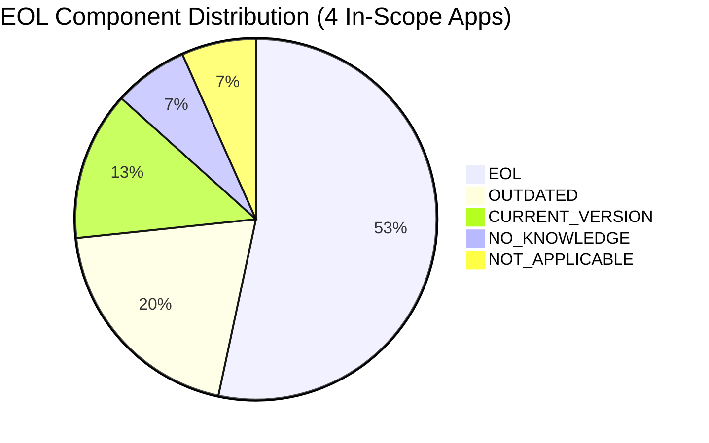
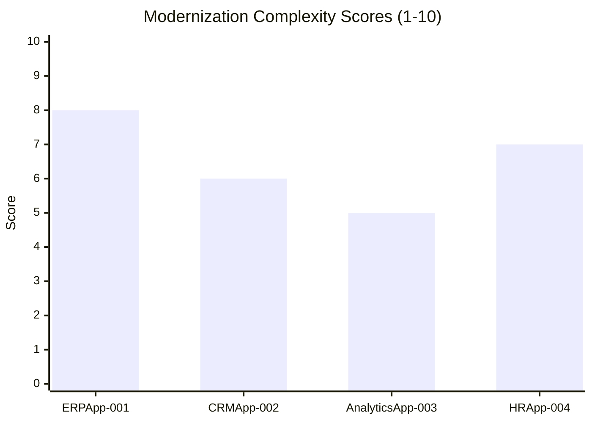
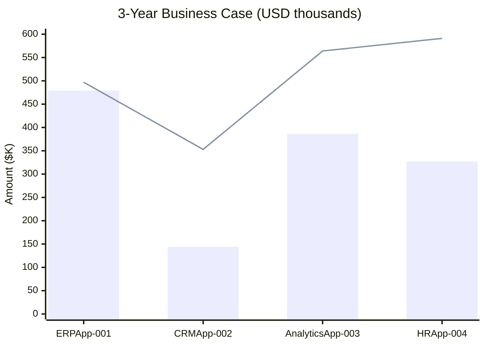

# Portfolio Modernization Assessment Report

**Generated:** 2026-07-14 | **Tool:** GenDiscover | **Scope:** 5 applications (1 excluded)

---

## Portfolio Executive Summary

This assessment covers a portfolio of **5 applications** across Finance, Marketing, IT, HR, and Operations business units. One application (EComApp-005) is **Retired** and excluded from modernization planning.

### Portfolio at a Glance

| Metric | Value |
|---|---|
| Total Applications | 5 |
| In-Scope (Production) | 4 |
| Out-of-Scope (Retired) | 1 |
| Applications with EOL OS | 4 of 4 |
| Applications with EOL Components | 4 of 4 |
| Average Complexity Score | 6.5 / 10 |
| Total Modernization Investment | $1,336,100 |
| 3-Year Total Savings | $2,153,400 |
| 3-Year Net Benefit | $817,300 |
| Portfolio 3-Year ROI | **61.2%** |

---

## Technology Risk Summary

| Application | OS Status | Lang Status | App Server Status | DB Status | Risk Level |
|---|---|---|---|---|---|
| ERPApp-001 | ⛔ EOL (AIX 7.2) | ❓ NO_KNOWLEDGE | N/A | ✅ CURRENT | **CRITICAL** |
| CRMApp-002 | ⛔ EOL (RHEL 7) | ⚠️ OUTDATED | ⛔ EOL (WAS 7.0) | ✅ CURRENT | **HIGH** |
| AnalyticsApp-003 | ⛔ EOL (RHEL 7) | ⛔ EOL (Py 3.9) | ⛔ EOL (Tomcat 6.1) | ⛔ EOL (PG 13) | **HIGH** |
| HRApp-004 | ⛔ EOL (WS 2012) | ⚠️ OUTDATED | ⛔ EOL (IIS 8.0) | ⚠️ OUTDATED | **HIGH** |
| EComApp-005 | — | — | — | — | *RETIRED* |

---

## Complexity Scores

| Application | Score | Label | Primary Driver |
|---|---|---|---|
| ERPApp-001 | 8/10 | Very High | COBOL monolith on EOL AIX |
| HRApp-004 | 7/10 | High | EOL Windows stack, hybrid deployment, sensitive data |
| CRMApp-002 | 6/10 | Medium-High | EOL WebSphere, 3rd-party constraints |
| AnalyticsApp-003 | 5/10 | Medium | All-EOL stack but containerized and low criticality |

---

## Application Profiles

### ERPApp-001 — Finance ERP (Complexity: 8/10)
- **Stack:** COBOL-2014 on AIX 7.2, Oracle 19c — On-Premise
- **Key Risk:** AIX EOL, shrinking COBOL talent pool, 1-Tier monolith
- **Top Scenarios:** OS migration to Linux, Application refactor (strangler-fig), Cloud deployment
- **Investment:** $479,200 | **3-yr Savings:** $496,500 | **ROI:** 3.6%

### CRMApp-002 — Marketing CRM (Complexity: 6/10)
- **Stack:** Java 11 / WebSphere 7.0 on RHEL 7, RDS MySQL — AWS
- **Key Risk:** WebSphere 7.0 EOL since 2015 (critical security exposure)
- **Top Scenarios:** WebSphere replacement, OS upgrade, Containerization
- **Investment:** $143,640 | **3-yr Savings:** $352,500 | **ROI:** 145.4%

### AnalyticsApp-003 — IT Analytics (Complexity: 5/10)
- **Stack:** Python 3.9 / Tomcat 6.1 on RHEL 7, PostgreSQL 13 — AWS (containerized)
- **Key Risk:** All 4 components EOL but easily upgradeable
- **Top Scenarios:** Full stack upgrade (OS, Python, Tomcat, PostgreSQL)
- **Investment:** $386,000 | **3-yr Savings:** $564,000 | **ROI:** 46.1%

### HRApp-004 — HR Management (Complexity: 7/10)
- **Stack:** .NET Core / IIS 8.0 on Windows Server 2012, SQL Server 2019 — Hybrid
- **Key Risk:** HR/payroll data on EOL OS — compliance and security risk
- **Top Scenarios:** OS upgrade, IIS replacement, Full cloud migration
- **Investment:** $327,260 | **3-yr Savings:** $591,000 | **ROI:** 80.6%

---

## Business Case Summary

| Application | Migration Cost | 3-yr Savings | 3-yr ROI |
|---|---|---|---|
| ERPApp-001 | $479,200 | $496,500 | 3.6% |
| CRMApp-002 | $143,640 | $352,500 | 145.4% |
| AnalyticsApp-003 | $386,000 | $564,000 | 46.1% |
| HRApp-004 | $327,260 | $591,000 | 80.6% |
| **Portfolio Total** | **$1,336,100** | **$2,153,400** | **61.2%** |

---

## Prioritized Recommendations

### Immediate Actions (0–3 months)
1. **CRITICAL:** Replace WebSphere 7.0 on CRMApp-002 — EOL since 2015, active security risk
2. **CRITICAL:** Upgrade Windows Server 2012 on HRApp-004 — HR/payroll data compliance risk
3. **CRITICAL:** Upgrade IIS 8.0 on HRApp-004 — tied to Windows Server 2012 EOL
4. **HIGH:** Upgrade RHEL 7 on CRMApp-002 and AnalyticsApp-003

### Short-Term (3–12 months)
5. Upgrade Python 3.9 → 3.12 on AnalyticsApp-003
6. Upgrade PostgreSQL 13 → 16 on AnalyticsApp-003
7. Upgrade Tomcat 6.1 → 10.x on AnalyticsApp-003
8. Containerize CRMApp-002 for AWS Kubernetes
9. Clarify .NET Core version on HRApp-004

### Medium-Term (1–2 years)
10. Migrate HRApp-004 to full cloud (eliminate hybrid deployment)
11. Upgrade Java 11 → Java 21 on CRMApp-002
12. Migrate ERPApp-001 OS: AIX → Linux (RHEL/Ubuntu)
13. Plan Oracle 19c → managed DB migration for ERPApp-001 (2027 deadline)

### Long-Term (2–5 years)
14. ERPApp-001 COBOL modernization (strangler-fig pattern)
15. SQL Server → PostgreSQL migration for HRApp-004 (license elimination)
16. ARM/Graviton migration for CRMApp-002 and AnalyticsApp-003

---

## Out-of-Scope Application

| Application | Status | Reason |
|---|---|---|
| EComApp-005 | Retired | Application has been decommissioned. No modernization assessment performed. |

---

*Generated by GenDiscover — Application Modernization with Agentic AI powered by Capgemini GenSuite*
