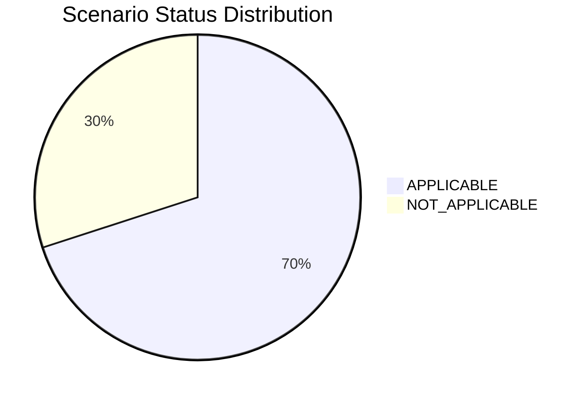

# Application Report — ERPApp-001

> **Application ID:** `app001` | **Business Unit:** Finance | **Criticality:** High | **Status:** Production

_Core ERP system handling financial transactions, general ledger, and regulatory reporting_

---

## Application Overview

| Attribute | Value |
|---|---|
| **Solution Type** | Custom made |
| **Deployment** | On-Premise |
| **Architecture** | 1-Tier |
| **Operating System** | AIX 7.2 |
| **Programming Language** | COBOL-2014 |
| **Application Server** | None |
| **Database** | Oracle 19c |
| **Users** | 350 |
| **Containerized** | No |
| **CI/CD** | No |
| **API Endpoints** | 0 |
| **External Interfaces** | 5 |
| **DB Storage** | 1000 GB |
| **DB License Required** | Yes |

---

## Technology Assessment

| Component | Type | Version | Status | EOL Date | Confidence |
|---|---|---|---|---|---|
| AIX 7.2 | os | 7.2 | 🔴 EOL | 2025-04-30 | 8/10 |
| COBOL-2014 | programming_language | 2014 | 🟡 OUTDATED | N/A | 7/10 |
| Oracle 19c | database | 19c | 🟡 OUTDATED | 2027-12-31 | 9/10 |

**Summary:** 1 EOL component(s), 2 OUTDATED component(s)

---

## Complexity Assessment

**Complexity Score:** `█████████░` 9/10 — **Very High**

ERPApp-001 represents one of the most complex modernization challenges in the portfolio. The combination of EOL AIX 7.2, legacy COBOL-2014 codebase, 1-Tier monolithic architecture, on-premise deployment without CI/CD or containerization, and High business criticality creates a very high-risk modernization scenario. The 1000GB Oracle database, 5 external interfaces, and 2027 decommission target add further urgency. Any modernization effort will require extensive planning, testing, and phased migration to avoid disruption to critical financial operations.

| Factor | Score | Max | Notes |
|---|---|---|---|
| EOL Components | 3 | 3 | AIX 7.2 EOL (Apr 2025), COBOL-2014 outdated paradigm, Oracle 19c in Extended Support |
| Business Criticality | 3 | 3 | High criticality Finance ERP handling regulatory reporting and financial transactions |
| Architecture | 2 | 2 | 1-Tier monolithic architecture with no separation of concerns; no API endpoints |
| Infrastructure | 1 | 1 | On-premise deployment on proprietary AIX platform; 2 servers |
| Integration Complexity | 1 | 2 | 5 external interfaces; no REST API endpoints exposed |
| Deployment Maturity | 2 | 2 | No CI/CD pipeline, not containerized; fully manual deployments |
| Modernization Risk | 2 | 2 | Legacy COBOL codebase on proprietary AIX with Oracle; high migration effort and risk; decommission target 2027 |

---

## Scenario Applicability

| Scenario | Status | Key Reasoning |
|---|---|---|
| Operating System Update | 🔴 APPLICABLE | AIX 7.2 is end-of-life since April 2025. No security patches are available. The OS must be updated o… |
| Switch to standard Linux Operating System | 🔴 APPLICABLE | AIX 7.2 is a proprietary IBM Unix platform, not a standard Linux distribution. Migrating to RHEL, Ub… |
| Switch to ARM-based CPU | ⬜ NOT_APPLICABLE | Application runs on AIX 7.2 with COBOL-2014 and is not containerized. AIX is IBM's proprietary Unix … |
| Applications Server replacement | ⬜ NOT_APPLICABLE | ERPApp-001 uses no application server (null). It is a direct 1-Tier COBOL application. Application s… |
| Application Migration to Cloud Infrastructure (Lift & Shift) | 🔴 APPLICABLE | Application is currently deployed On-Premise on AIX hardware. Migrating to cloud infrastructure (e.g… |
| Application Containerization | ⬜ NOT_APPLICABLE | Application runs on AIX 7.2 with COBOL-2014 in a 1-Tier monolithic architecture. AIX is not a contai… |
| Application Refactoring and De-coupling | 🔴 APPLICABLE | 1-Tier monolithic COBOL architecture with 0 API endpoints and 5 external interfaces. The monolith mu… |
| Upgrade Legacy Databases | 🔴 APPLICABLE | Oracle 19c has exited Premier Support (ended December 2024) and is in Extended Support until Decembe… |
| Switch DB Engine to open-source database solution | 🔴 APPLICABLE | Oracle 19c requires a paid commercial license. Switching to an open-source database (PostgreSQL) wou… |
| Update outdated components | 🔴 APPLICABLE | COBOL-2014 is a legacy language with outdated paradigms. AIX 7.2 is EOL. Oracle 19c is in extended s… |

### Scenario Status Distribution

---

## Business Case

| Metric | Value |
|---|---|
| Total Upfront Investment | $582,600 |
| Annual Savings | $178,900/yr |
| ROI (3-Year) | -7.9% |
| ROI (5-Year) | 53.5% |
| Complexity Multiplier | 2.0× |

**Applicable Scenario Costs:**

| Scenario | Base Cost | Adjusted Cost | Annual Savings |
|---|---|---|---|
| Operating System Update | $1,000 | $2,000 | $500/yr |
| Switch to standard Linux Operating System | $300 | $600 | $400/yr |
| Application Migration to Cloud Infrastructure (Lift & Shift) | $5,000 | $10,000 | $3,000/yr |
| Application Refactoring and De-coupling | $250,000 | $500,000 | $150,000/yr |
| Upgrade Legacy Databases | $10,000 | $20,000 | $10,000/yr |
| Switch DB Engine to open-source database solution | $25,000 | $50,000 | $15,000/yr |

---

_Report generated: 2026-07-21 | Analysis by GenDiscover_
