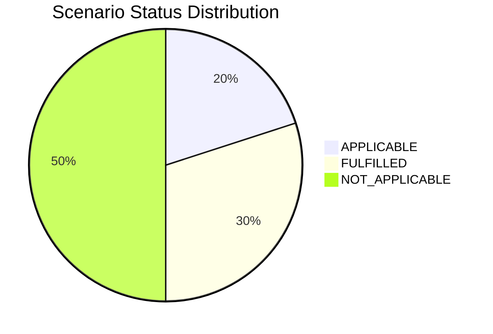

# Application Report — CRMApp-002

> **Application ID:** `app002` | **Business Unit:** Marketing | **Criticality:** Medium | **Status:** Production

_Customer relationship management system for tracking leads, opportunities, and customer interactions_

---

## Application Overview

| Attribute | Value |
|---|---|
| **Solution Type** | 3rd party software |
| **Deployment** | AWS |
| **Architecture** | unknown |
| **Operating System** | RHEL 7 |
| **Programming Language** | Java 11 |
| **Application Server** | Websphere 7.0 |
| **Database** | Amazon RDS MySQL |
| **Users** | 1,200 |
| **Containerized** | No |
| **CI/CD** | Yes |
| **API Endpoints** | 15 |
| **External Interfaces** | 8 |
| **DB Storage** | 500 GB |
| **DB License Required** | No |

---

## Technology Assessment

| Component | Type | Version | Status | EOL Date | Confidence |
|---|---|---|---|---|---|
| RHEL 7 | os | 7 | 🔴 EOL | 2024-06-30 | 10/10 |
| Java 11 | programming_language | 11 | 🟡 OUTDATED | 2026-09-30 | 9/10 |
| WebSphere 7.0 | application_server | 7.0 | 🔴 EOL | 2015-09-30 | 10/10 |
| Amazon RDS MySQL | database | managed | ✅ CURRENT | N/A | 9/10 |

**Summary:** 2 EOL component(s), 1 OUTDATED component(s)

---

## Complexity Assessment

**Complexity Score:** `██████░░░░` 6/10 — **Medium-High**

CRMApp-002 presents medium-high complexity due to a combination of severely outdated infrastructure components (WebSphere 7.0 is 10+ years past EOL, RHEL 7 EOL 2024) and the constraints imposed by being 3rd party software. While AWS deployment and CI/CD reduce some risk, the vendor dependency for component upgrades and the 8 external interfaces/15 API endpoints increase coordination complexity. WebSphere 7.0 replacement is the most critical action item.

| Factor | Score | Max | Notes |
|---|---|---|---|
| EOL Components | 2 | 3 | RHEL 7 EOL (Jun 2024), WebSphere 7.0 EOL (Sep 2015); Amazon RDS MySQL is managed/current |
| Business Criticality | 2 | 3 | Medium criticality CRM; important for sales and marketing operations |
| Architecture | 1 | 2 | Architecture type unknown (3rd party software); CRM system with 15 API endpoints |
| Infrastructure | 0 | 1 | Already deployed on AWS; good cloud-native positioning |
| Integration Complexity | 2 | 2 | 8 external interfaces, 15 API endpoints; high integration surface area for a 3rd party system |
| Deployment Maturity | 1 | 2 | CI/CD present; not containerized - limited by 3rd party software constraints |
| Modernization Risk | 1 | 2 | 3rd party software limits upgrade options to vendor-managed upgrades; RHEL and WebSphere must be coordinated with vendor |

---

## Scenario Applicability

| Scenario | Status | Key Reasoning |
|---|---|---|
| Operating System Update | 🔴 APPLICABLE | RHEL 7 reached end-of-life on June 30, 2024. No further security patches are available. The operatin… |
| Switch to standard Linux Operating System | ✅ FULFILLED | RHEL 7 is already a standard Linux distribution. The application already runs on standard Linux, sat… |
| Switch to ARM-based CPU | ⬜ NOT_APPLICABLE | CRMApp-002 is 3rd party software. ARM CPU migration requires vendor support and certification. Third… |
| Applications Server replacement | 🔴 APPLICABLE | WebSphere 7.0 reached end-of-service on September 30, 2015 - over 10 years ago. This represents a cr… |
| Application Migration to Cloud Infrastructure (Lift & Shift) | ✅ FULFILLED | CRMApp-002 is already deployed on AWS. The application meets the cloud deployment objective. |
| Application Containerization | ⬜ NOT_APPLICABLE | CRMApp-002 is 3rd party software. Containerization is vendor-controlled and cannot be independently … |
| Application Refactoring and De-coupling | ⬜ NOT_APPLICABLE | CRMApp-002 is 3rd party software. Application refactoring is not feasible as source code is vendor-o… |
| Upgrade Legacy Databases | ⬜ NOT_APPLICABLE | Amazon RDS MySQL is a fully managed AWS service. AWS manages version upgrades and patching. The data… |
| Switch DB Engine to open-source database solution | ✅ FULFILLED | MySQL is already an open-source database engine. This scenario objective is already satisfied. |
| Update outdated components | ⬜ NOT_APPLICABLE | CRMApp-002 is 3rd party software. Component updates are vendor-managed and cannot be independently a… |

### Scenario Status Distribution

---

## Business Case

| Metric | Value |
|---|---|
| Total Upfront Investment | $16,500 |
| Annual Savings | $12,500/yr |
| ROI (3-Year) | 127.3% |
| ROI (5-Year) | 278.8% |
| Complexity Multiplier | 1.5× |

**Applicable Scenario Costs:**

| Scenario | Base Cost | Adjusted Cost | Annual Savings |
|---|---|---|---|
| Operating System Update | $1,000 | $1,500 | $500/yr |
| Applications Server replacement | $10,000 | $15,000 | $12,000/yr |

---

_Report generated: 2026-07-21 | Analysis by GenDiscover_
