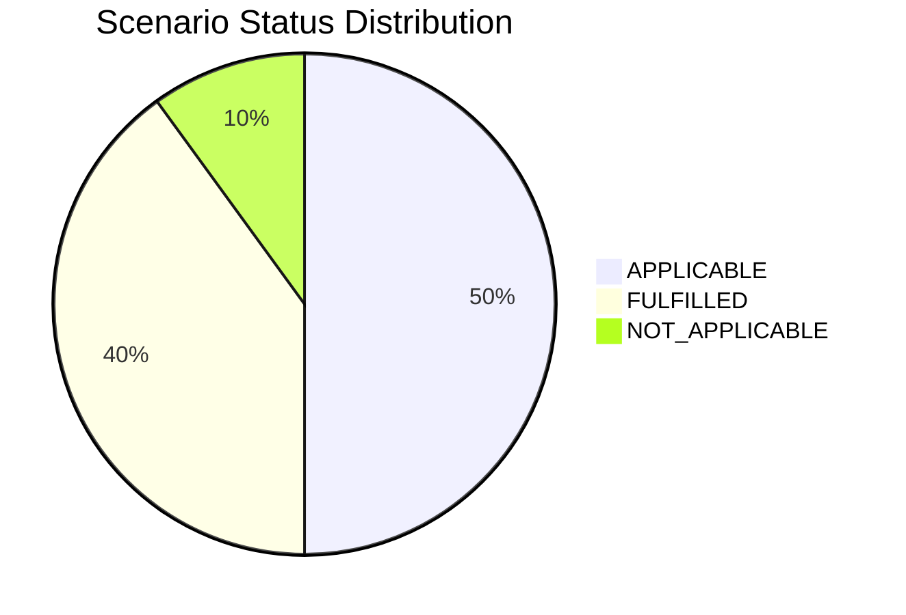

# Application Report — AnalyticsApp-003

> **Application ID:** `app003` | **Business Unit:** IT | **Criticality:** Low | **Status:** Production

_Analytics platform for generating operational reports and business insights from logistics data_

---

## Application Overview

| Attribute | Value |
|---|---|
| **Solution Type** | Open Source |
| **Deployment** | AWS |
| **Architecture** | 3-Tier |
| **Operating System** | RHEL 7 |
| **Programming Language** | Python 3.9 |
| **Application Server** | Apache Tomcat 6.1 |
| **Database** | PostgreSQL 13 |
| **Users** | 480 |
| **Containerized** | Yes |
| **CI/CD** | Yes |
| **API Endpoints** | 8 |
| **External Interfaces** | 3 |
| **DB Storage** | 200 GB |
| **DB License Required** | No |

---

## Technology Assessment

| Component | Type | Version | Status | EOL Date | Confidence |
|---|---|---|---|---|---|
| RHEL 7 | os | 7 | 🔴 EOL | 2024-06-30 | 10/10 |
| Python 3.9 | programming_language | 3.9 | 🔴 EOL | 2025-10-31 | 10/10 |
| Apache Tomcat 6.1 | application_server | 6.1 | 🔴 EOL | 2016-12-31 | 10/10 |
| PostgreSQL 13 | database | 13 | 🔴 EOL | 2025-11-13 | 10/10 |

**Summary:** 4 EOL component(s), 0 OUTDATED component(s)

---

## Complexity Assessment

**Complexity Score:** `████░░░░░░` 4/10 — **Medium**

AnalyticsApp-003 scores medium complexity despite having all 4 technology components at EOL status. The low business criticality, excellent deployment maturity (containerized, CI/CD, AWS), 3-Tier architecture, and open source nature make component upgrades achievable without high risk. The main challenge is coordinating upgrades of RHEL 7, Python 3.9, Tomcat 6.1, and PostgreSQL 13 simultaneously while maintaining analytics service availability. The single server deployment and minimal external interfaces further reduce complexity.

| Factor | Score | Max | Notes |
|---|---|---|---|
| EOL Components | 2 | 3 | RHEL 7 EOL, Python 3.9 EOL (Oct 2025), Tomcat 6.1 EOL (Dec 2016), PostgreSQL 13 EOL (Nov 2025) - all 4 components EOL |
| Business Criticality | 1 | 3 | Low business criticality analytics/reporting platform; limited operational impact if unavailable |
| Architecture | 1 | 2 | 3-Tier architecture is well-structured; already modular open source stack |
| Infrastructure | 0 | 1 | AWS deployment, single server, containerized, CI/CD - excellent infrastructure maturity |
| Integration Complexity | 0 | 2 | Only 3 external interfaces, 8 API endpoints; low integration complexity |
| Deployment Maturity | 0 | 2 | Already containerized with CI/CD; best deployment maturity in portfolio |
| Modernization Risk | 1 | 2 | Multiple EOL components require coordinated upgrades but open source nature enables self-managed upgrades |

---

## Scenario Applicability

| Scenario | Status | Key Reasoning |
|---|---|---|
| Operating System Update | 🔴 APPLICABLE | RHEL 7 reached end-of-life on June 30, 2024. No further security patches are available. Upgrade to R… |
| Switch to standard Linux Operating System | ✅ FULFILLED | RHEL 7 is already a standard Linux distribution. The application runs on standard Linux, satisfying … |
| Switch to ARM-based CPU | 🔴 APPLICABLE | AnalyticsApp-003 runs on Linux (RHEL 7), is containerized, uses Python 3.9 (ARM-compatible), and is … |
| Applications Server replacement | 🔴 APPLICABLE | Apache Tomcat 6.1 reached end-of-life in December 2016 - over 9 years ago. This is a critical securi… |
| Application Migration to Cloud Infrastructure (Lift & Shift) | ✅ FULFILLED | AnalyticsApp-003 is already deployed on AWS. Cloud deployment objective is fully satisfied. |
| Application Containerization | ✅ FULFILLED | AnalyticsApp-003 is already containerized. This scenario objective is fully satisfied. |
| Application Refactoring and De-coupling | ⬜ NOT_APPLICABLE | AnalyticsApp-003 already has a 3-Tier architecture and is open source (not custom-made). The existin… |
| Upgrade Legacy Databases | 🔴 APPLICABLE | PostgreSQL 13 reached end-of-life in November 2025. No further bug fixes or security patches are ava… |
| Switch DB Engine to open-source database solution | ✅ FULFILLED | PostgreSQL is already an open-source database engine. This scenario objective is fully satisfied. |
| Update outdated components | 🔴 APPLICABLE | Python 3.9 is EOL (October 2025) and Tomcat 6.1 is EOL (December 2016). Both primary runtime compone… |

### Scenario Status Distribution

---

## Business Case

| Metric | Value |
|---|---|
| Total Upfront Investment | $32,500 |
| Annual Savings | $23,500/yr |
| ROI (3-Year) | 116.9% |
| ROI (5-Year) | 261.5% |
| Complexity Multiplier | 1.25× |

**Applicable Scenario Costs:**

| Scenario | Base Cost | Adjusted Cost | Annual Savings |
|---|---|---|---|
| Operating System Update | $1,000 | $1,250 | $500/yr |
| Switch to ARM-based CPU | $5,000 | $6,250 | $1,000/yr |
| Applications Server replacement | $10,000 | $12,500 | $12,000/yr |
| Upgrade Legacy Databases | $10,000 | $12,500 | $10,000/yr |

---

_Report generated: 2026-07-21 | Analysis by GenDiscover_
