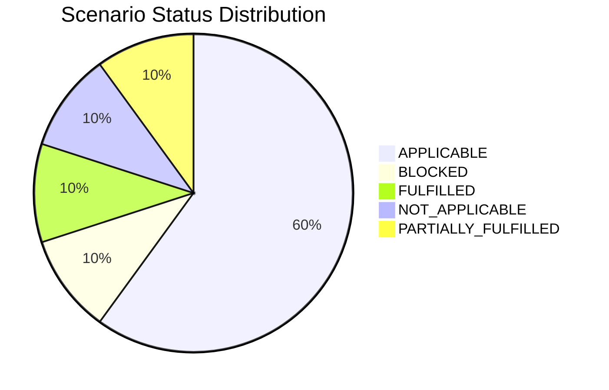

# Application Report — HRApp-004

> **Application ID:** `app004` | **Business Unit:** HR | **Criticality:** High | **Status:** Production

_Human resources management system handling employee records, benefits, and HR workflows_

---

## Application Overview

| Attribute | Value |
|---|---|
| **Solution Type** | Custom made |
| **Deployment** | AWS, On-premise |
| **Architecture** | 2-Tier |
| **Operating System** | Windows Server 2012 |
| **Programming Language** | .NET Core |
| **Application Server** | Microsoft IIS 8.0 |
| **Database** | SQL Server 2019 |
| **Users** | 670 |
| **Containerized** | Yes |
| **CI/CD** | Yes |
| **API Endpoints** | 12 |
| **External Interfaces** | 6 |
| **DB Storage** | 750 GB |
| **DB License Required** | Yes |

---

## Technology Assessment

| Component | Type | Version | Status | EOL Date | Confidence |
|---|---|---|---|---|---|
| Windows Server 2012 | os | 2012 | 🔴 EOL | 2023-10-10 | 10/10 |
| .NET Core | programming_language | unknown | 🟡 OUTDATED | N/A | 5/10 |
| Microsoft IIS 8.0 | application_server | 8.0 | 🔴 EOL | 2023-10-10 | 10/10 |
| SQL Server 2019 | database | 2019 | 🟡 OUTDATED | 2030-01-08 | 9/10 |

**Summary:** 2 EOL component(s), 2 OUTDATED component(s)

---

## Complexity Assessment

**Complexity Score:** `███████░░░` 7/10 — **High**

HRApp-004 presents high modernization complexity driven by the combination of EOL Windows Server 2012 (critical security risk), custom-made .NET Core codebase with unspecified version, hybrid AWS+On-premise deployment, and High business criticality. The 2-Tier architecture with 6 external interfaces and 12 API endpoints for a 670-user HR system increases migration risk. While containerization and CI/CD are positives, the Windows-only application server (IIS 8.0), SQL Server paid license, and incomplete cloud migration create multiple parallel modernization tracks needed.

| Factor | Score | Max | Notes |
|---|---|---|---|
| EOL Components | 2 | 3 | Windows Server 2012 EOL (Oct 2023), IIS 8.0 EOL (Oct 2023); .NET Core version unspecified (risk), SQL Server 2019 OUTDATED |
| Business Criticality | 3 | 3 | High criticality HR system managing employee records, payroll, and benefits for 670 users |
| Architecture | 1 | 2 | 2-Tier architecture with Custom made codebase; some coupling between tiers |
| Infrastructure | 1 | 1 | Hybrid AWS+On-premise deployment increases migration complexity and maintenance overhead |
| Integration Complexity | 2 | 2 | 6 external interfaces, 12 API endpoints; significant integration surface for HR workflows |
| Deployment Maturity | 0 | 2 | Already containerized with CI/CD; mitigates some complexity |
| Modernization Risk | 2 | 2 | Custom-made on Windows with unversioned .NET Core; hybrid infrastructure; Windows EOL blocks ARM migration path |

---

## Scenario Applicability

| Scenario | Status | Key Reasoning |
|---|---|---|
| Operating System Update | 🔴 APPLICABLE | Windows Server 2012 reached end-of-support on October 10, 2023. No free security updates are availab… |
| Switch to standard Linux Operating System | ⬜ NOT_APPLICABLE | HRApp-004 runs on Windows Server 2012 with IIS 8.0 as the application server. The application is Win… |
| Switch to ARM-based CPU | ⛔ BLOCKED | Windows Server 2012 is EOL and lacks ARM architecture support. While .NET Core is theoretically ARM-… |
| Applications Server replacement | 🔴 APPLICABLE | Microsoft IIS 8.0 is EOL as part of Windows Server 2012 (EOL October 2023). Upgrading to IIS 10.0 on… |
| Application Migration to Cloud Infrastructure (Lift & Shift) | 🔶 PARTIALLY_FULFILLED | HRApp-004 is partially deployed on AWS but retains an on-premise component (hybrid deployment: AWS +… |
| Application Containerization | ✅ FULFILLED | HRApp-004 is already containerized. This scenario objective is fully satisfied. |
| Application Refactoring and De-coupling | 🔴 APPLICABLE | HRApp-004 uses a 2-Tier architecture with 6 external interfaces and 12 API endpoints. As a custom-ma… |
| Upgrade Legacy Databases | 🔴 APPLICABLE | SQL Server 2019 mainstream support ended July 2025 and is classified as OUTDATED. While Extended Sup… |
| Switch DB Engine to open-source database solution | 🔴 APPLICABLE | SQL Server 2019 requires a paid Microsoft license. Switching to PostgreSQL would eliminate license c… |
| Update outdated components | 🔴 APPLICABLE | Windows Server 2012 is EOL, IIS 8.0 is EOL, .NET Core version is unspecified (potential EOL), and SQ… |

### Scenario Status Distribution

---

## Business Case

| Metric | Value |
|---|---|
| Total Upfront Investment | $451,500 |
| Annual Savings | $190,500/yr |
| ROI (3-Year) | 26.6% |
| ROI (5-Year) | 111.0% |
| Complexity Multiplier | 1.5× |

**Applicable Scenario Costs:**

| Scenario | Base Cost | Adjusted Cost | Annual Savings |
|---|---|---|---|
| Operating System Update | $1,000 | $1,500 | $500/yr |
| Applications Server replacement | $10,000 | $15,000 | $12,000/yr |
| Application Migration to Cloud Infrastructure (Lift & Shift) | $5,000 | $7,500 | $3,000/yr |
| Application Refactoring and De-coupling | $250,000 | $375,000 | $150,000/yr |
| Upgrade Legacy Databases | $10,000 | $15,000 | $10,000/yr |
| Switch DB Engine to open-source database solution | $25,000 | $37,500 | $15,000/yr |

---

_Report generated: 2026-07-21 | Analysis by GenDiscover_
