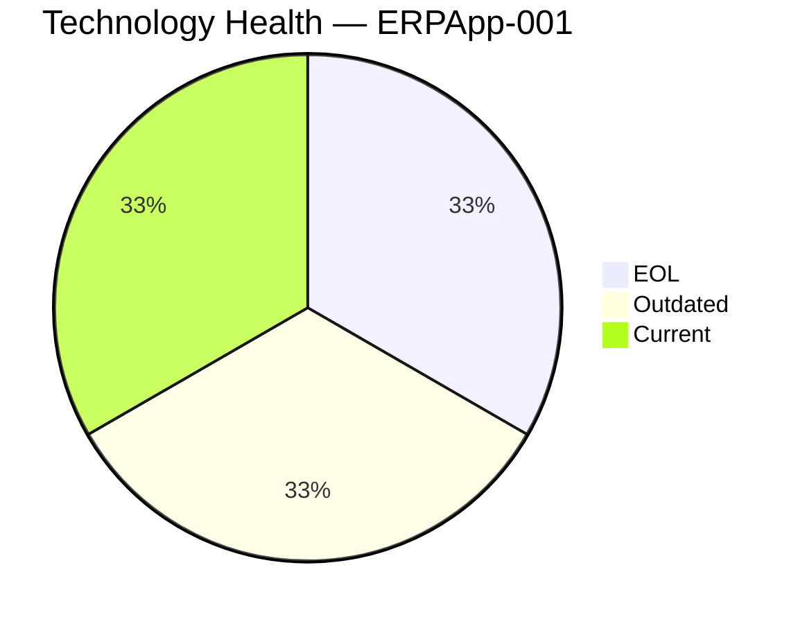
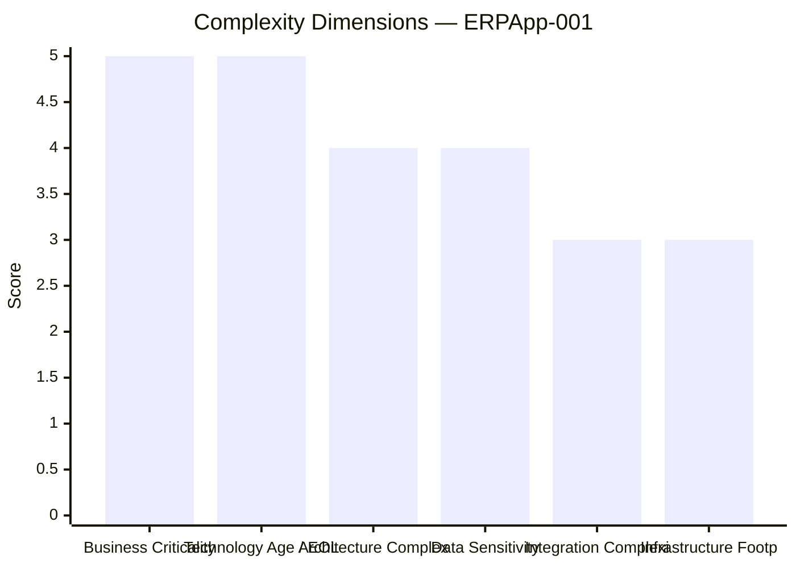
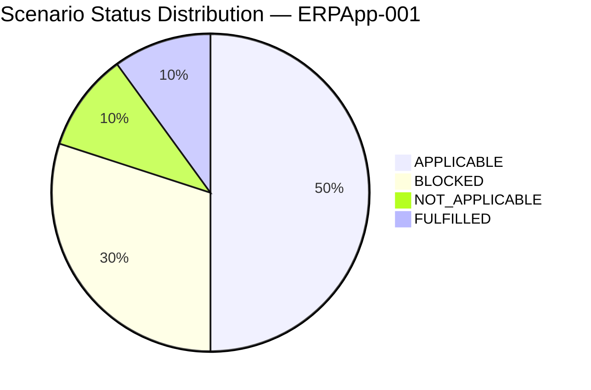

# Application Report — ERPApp-001 (APP001)

> **Generated:** 2026-07-30 | **GenDiscover Portfolio Modernization Assessment**

## Overview

| Attribute | Value |
|-----------|-------|
| **Application ID** | app001 |
| **Application Name** | ERPApp-001 |
| **Description** | Core ERP system handling financial transactions, general ledger, and regulatory reporting |
| **Solution Type** | Custom made |
| **Business Criticality** | High |
| **Application Status** | Production |
| **Deployment Type** | On-Premise |
| **Business Unit** | Finance |
| **Data Classification** | Confidential |
| **Number of Users** | 350 |
| **Business Capabilities** | Financial Planning, Accounting, Budgeting |
| **Is Containerized** | No |
| **CI/CD Present** | No |
| **Operating System** | AIX 7.2 |
| **Programming Language** | COBOL-2014 |
| **Application Server** | None |
| **Database Engine** | Oracle 19c |
| **DB License Required** | Yes |
| **Architecture** | 1-Tier |
| **API Endpoints** | 0 |
| **External Interfaces** | 5 |

## Technology Assessment

⚠️ **EOL components detected** | ⚠️ **Outdated components detected**

| Component | Type | Version | Status | EOL Date | Reasoning |
|-----------|------|---------|--------|----------|-----------|
| AIX 7.2 | os | 7.2 | 🔴 EOL | 2025-04-30 | IBM AIX 7.2 reached end of service on April 30, 2025. No further security patche… |
| COBOL-2014 | programming_language | 2014 | 🟡 Outdated | N/A | COBOL-2014 is an ISO standard revision. The language is still technically suppor… |
| Oracle 19c | database | 19c | ✅ Current | 2027-04-30 | Oracle Database 19c is a Long-Term Release supported until April 2027 (Premier S… |

## Complexity Assessment

**Complexity Score: 9/10 — Very High**

### Key Risk Factors

- COBOL programming language — extreme specialist skill scarcity
- AIX 7.2 operating system EOL — requires specialized IBM hardware/expertise
- 1-Tier monolithic architecture — no separation of concerns
- No CI/CD pipeline — manual deployments increase risk
- No API endpoints — tightly batch-oriented integration
- Planned decommission in 2027 — must plan migration path urgently

**Modernization Recommendation:** High urgency. Plan OS migration from AIX to Linux, and data/logic migration pathway away from COBOL before the 2027 decommission deadline. Oracle 19c is still supported and can be the anchor for data migration.

## Scenario Applicability

| Scenario | Status | Priority | Reasoning |
|----------|--------|----------|-----------|
| Operating System Update | 🔴 APPLICABLE | High | AIX 7.2 is EOL (April 2025). No security patches available. The OS must be replaced — howe… |
| Switch to standard Linux Operating System | 🔴 APPLICABLE | High | AIX 7.2 is a proprietary commercial Unix OS. The application is custom-developed (COBOL). … |
| Switch to ARM-based CPU | 🚫 BLOCKED | Low | COBOL-2014 on AIX makes ARM migration extremely complex. IBM AIX runs on IBM POWER process… |
| Applications Server replacement | ⚫ NOT_APPLICABLE | N/A | No application server is recorded for this application. The COBOL application appears to r… |
| Application Migration to Cloud Infrastructure (Lift & Shift) | 🚫 BLOCKED | Low | The application runs on IBM AIX — a proprietary Unix OS that is not supported by public cl… |
| Application Containerization | 🚫 BLOCKED | Low | AIX does not support Docker/container runtime. COBOL applications require specialized cont… |
| Application Refactoring and De-coupling | 🔴 APPLICABLE | High | 1-Tier monolithic COBOL architecture with no API endpoints. The application has 5 external… |
| Upgrade Legacy Databases | ✅ FULFILLED | N/A | Oracle 19c is a current Long-Term Release with support until April 2027. The database comp… |
| Switch DB Engine to open-source database solution | 🔴 APPLICABLE | Medium | Oracle 19c requires an expensive commercial license (confirmed: DB License required = Yes)… |
| Update outdated components | 🔴 APPLICABLE | High | COBOL-2014 on AIX is a legacy technology stack. AIX is EOL. The entire application stack i… |

## Business Case

| Metric | Value |
|--------|-------|
| Total Migration Cost | $587,340 |
| Annual Savings | $185,900 |
| Net Benefit (3 years) | $-29,640 |
| 3-Year ROI | -5.0% |
| Complexity Multiplier | 1.8x |

### Scenario Cost Breakdown

| Scenario | Migration Cost | Yearly Savings | 3yr Net Benefit |
|----------|---------------|----------------|-----------------|
| os_update_security_patch | $1,800 | $500 | $-300 |
| switch_to_standard_linux_os | $540 | $400 | $660 |
| app_refactor_decoupling | $450,000 | $150,000 | $0 |
| switch_db_engine_open_source | $45,000 | $15,000 | $0 |
| update_outdated_components | $90,000 | $20,000 | $-30,000 |

---
*Report generated by GenDiscover | 2026-07-30*