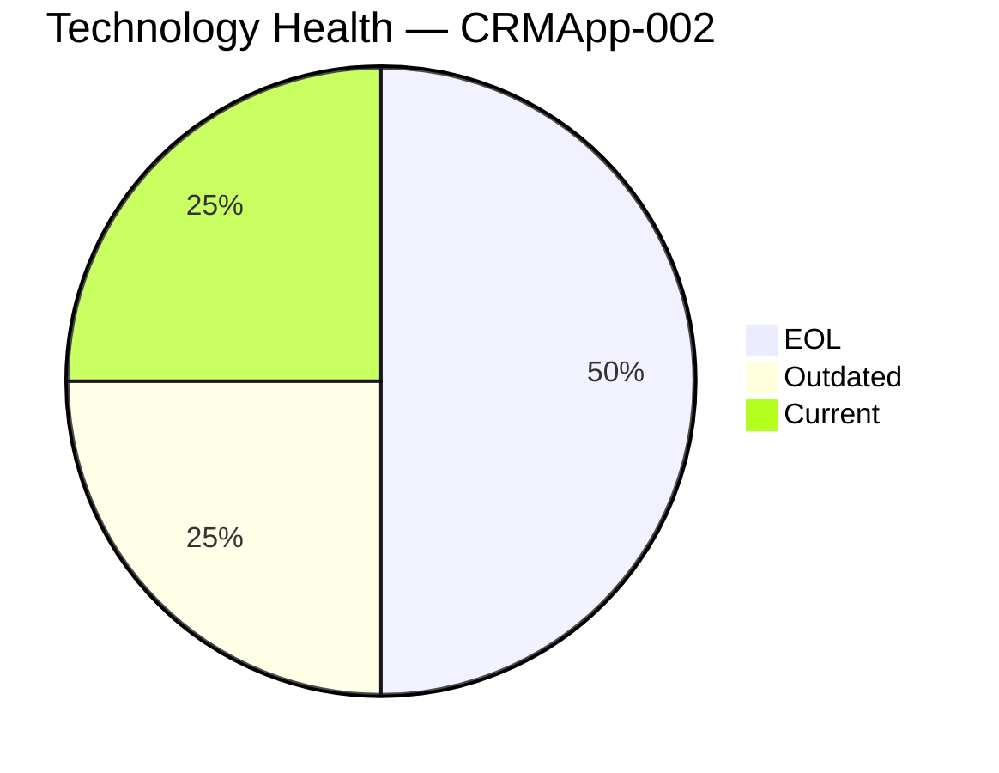
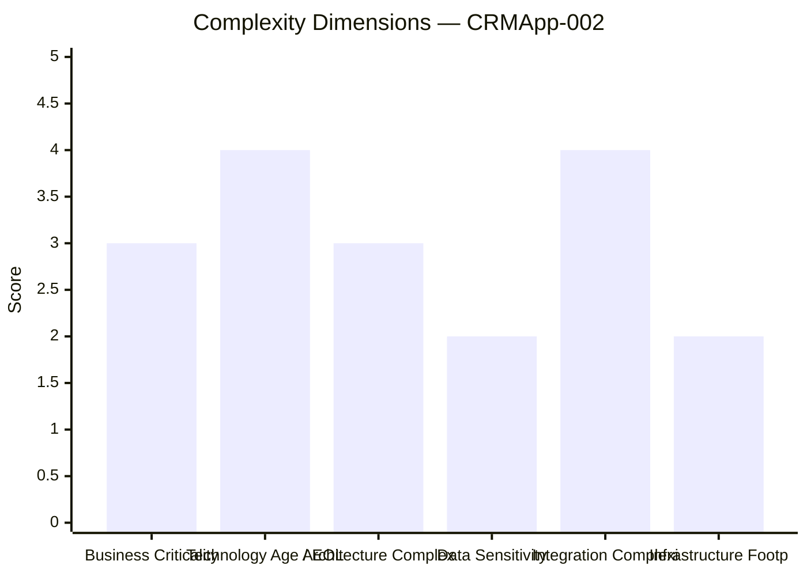
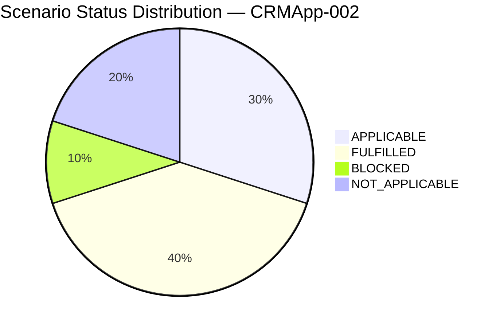

# Application Report — CRMApp-002 (APP002)

> **Generated:** 2026-07-30 | **GenDiscover Portfolio Modernization Assessment**

## Overview

| Attribute | Value |
|-----------|-------|
| **Application ID** | app002 |
| **Application Name** | CRMApp-002 |
| **Description** | Customer relationship management system for tracking leads, opportunities, and customer interactions |
| **Solution Type** | 3rd party software |
| **Business Criticality** | Medium |
| **Application Status** | Production |
| **Deployment Type** | AWS |
| **Business Unit** | Marketing |
| **Data Classification** | Internal |
| **Number of Users** | 1200 |
| **Business Capabilities** | Customer Management, Lead Tracking, Sales Analytics |
| **Is Containerized** | No |
| **CI/CD Present** | Yes |
| **Operating System** | RHEL 7 |
| **Programming Language** | Java 11 |
| **Application Server** | Websphere 7.0 |
| **Database Engine** | Amazon RDS MySQL |
| **DB License Required** | No |
| **Architecture** | unknown |
| **API Endpoints** | 15 |
| **External Interfaces** | 8 |

## Technology Assessment

⚠️ **EOL components detected** | ⚠️ **Outdated components detected**

| Component | Type | Version | Status | EOL Date | Reasoning |
|-----------|------|---------|--------|----------|-----------|
| RHEL 7 | os | 7 | 🔴 EOL | 2024-06-30 | RHEL 7 reached End of Maintenance Support on June 30, 2024. No further free secu… |
| Java 11 | programming_language | 11 | 🟡 Outdated | 2026-09-30 | Java 11 LTS Premier Support from Oracle ended September 2023. Community OpenJDK … |
| WebSphere 7.0 | application_server | 7.0 | 🔴 EOL | 2015-04-30 | IBM WebSphere Application Server 7.0 reached end of support on April 30, 2015 — … |
| Amazon RDS MySQL | database | unknown | ✅ Current | N/A | Amazon RDS MySQL is a managed service. AWS automatically manages patching and ve… |

## Complexity Assessment

**Complexity Score: 6/10 — Medium-High**

### Key Risk Factors

- WebSphere 7.0 — EOL since 2015, active security risk
- RHEL 7 — EOL June 2024, no free patches
- 3rd party software — limited control over internal architecture
- 8 external interfaces — upgrade coordination required
- Unknown architecture — assessment gaps

**Modernization Recommendation:** Medium-high urgency. Replace WebSphere 7.0 immediately (critical EOL risk). Upgrade OS from RHEL 7 to RHEL 9. As 3rd party software, coordinate with vendor for upgrade path.

## Scenario Applicability

| Scenario | Status | Priority | Reasoning |
|----------|--------|----------|-----------|
| Operating System Update | 🔴 APPLICABLE | High | RHEL 7 is EOL (June 2024). Security patches no longer freely available. Upgrade to RHEL 9 … |
| Switch to standard Linux Operating System | ✅ FULFILLED | N/A | Application already runs on RHEL (Red Hat Enterprise Linux), a standard enterprise Linux d… |
| Switch to ARM-based CPU | 🚫 BLOCKED | Low | 3rd party software — the vendor must certify the application for ARM. No information is av… |
| Applications Server replacement | 🔴 APPLICABLE | High | WebSphere 7.0 reached EOL in April 2015 — over a decade ago. This is a critical security a… |
| Application Migration to Cloud Infrastructure (Lift & Shift) | ✅ FULFILLED | N/A | Application is already deployed on AWS cloud infrastructure with Amazon RDS MySQL as the m… |
| Application Containerization | ⚫ NOT_APPLICABLE | N/A | 3rd party software — containerization of the application runtime is vendor-controlled. Cus… |
| Application Refactoring and De-coupling | ⚫ NOT_APPLICABLE | N/A | 3rd party software — internal architecture and source code are not under customer control.… |
| Upgrade Legacy Databases | ✅ FULFILLED | N/A | Amazon RDS MySQL is a managed service. AWS handles version lifecycle. Database is maintain… |
| Switch DB Engine to open-source database solution | ✅ FULFILLED | N/A | Amazon RDS MySQL is already an open-source database engine with no commercial licensing fe… |
| Update outdated components | 🔴 APPLICABLE | High | RHEL 7 (EOL), WebSphere 7.0 (critically EOL), and Java 11 (outdated) are all below current… |

## Business Case

| Metric | Value |
|--------|-------|
| Total Migration Cost | $79,300 |
| Annual Savings | $32,500 |
| Net Benefit (3 years) | $18,200 |
| 3-Year ROI | 23.0% |
| Complexity Multiplier | 1.3x |

### Scenario Cost Breakdown

| Scenario | Migration Cost | Yearly Savings | 3yr Net Benefit |
|----------|---------------|----------------|-----------------|
| os_update_security_patch | $1,300 | $500 | $200 |
| application_server_replacement | $13,000 | $12,000 | $23,000 |
| update_outdated_components | $65,000 | $20,000 | $-5,000 |

---
*Report generated by GenDiscover | 2026-07-30*