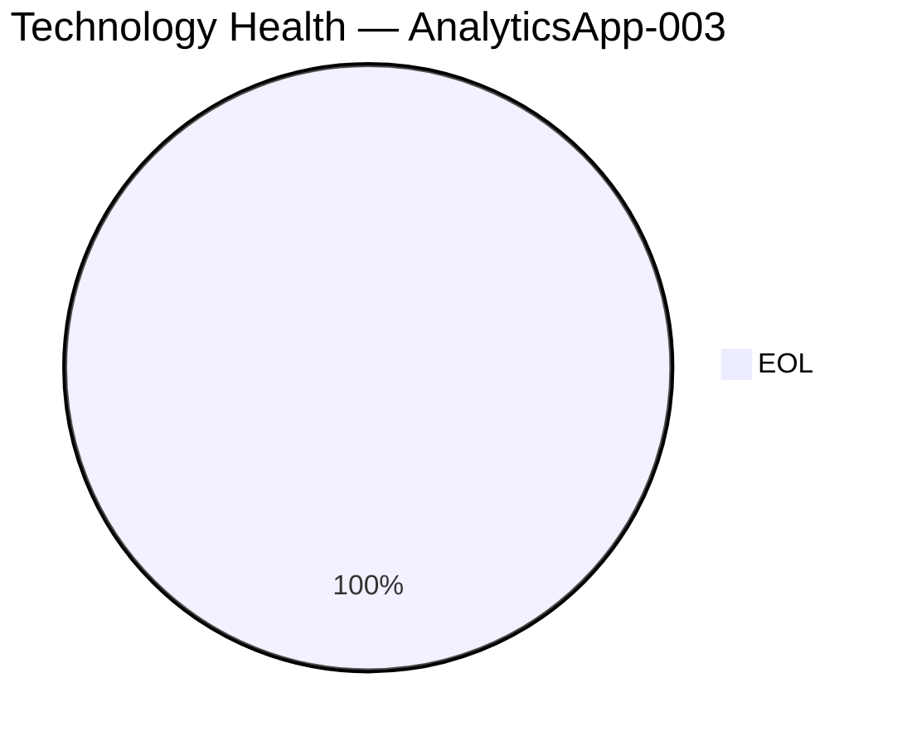
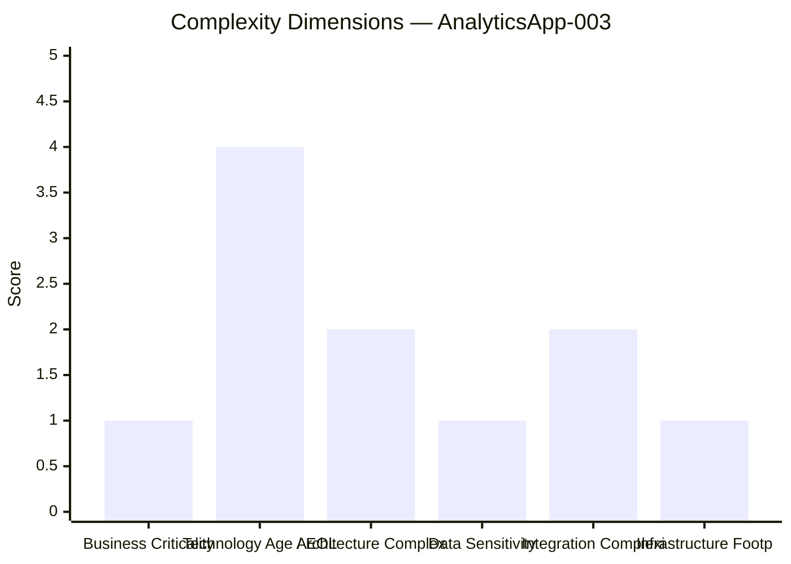
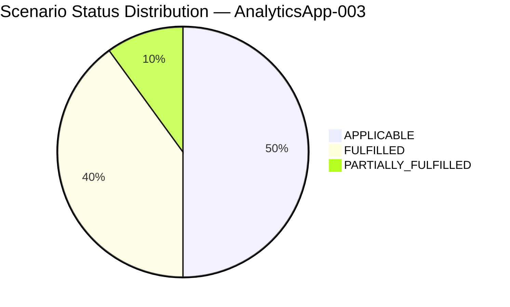

# Application Report — AnalyticsApp-003 (APP003)

> **Generated:** 2026-07-30 | **GenDiscover Portfolio Modernization Assessment**

## Overview

| Attribute | Value |
|-----------|-------|
| **Application ID** | app003 |
| **Application Name** | AnalyticsApp-003 |
| **Description** | Analytics platform for generating operational reports and business insights from logistics data |
| **Solution Type** | Open Source |
| **Business Criticality** | Low |
| **Application Status** | Production |
| **Deployment Type** | AWS |
| **Business Unit** | IT |
| **Data Classification** | Public |
| **Number of Users** | 480 |
| **Business Capabilities** | Data Analytics, Reporting, Business Intelligence |
| **Is Containerized** | Yes |
| **CI/CD Present** | Yes |
| **Operating System** | RHEL 7 |
| **Programming Language** | Python 3.9 |
| **Application Server** | Apache Tomcat 6.1 |
| **Database Engine** | PostgreSQL 13 |
| **DB License Required** | No |
| **Architecture** | 3-Tier |
| **API Endpoints** | 8 |
| **External Interfaces** | 3 |

## Technology Assessment

⚠️ **EOL components detected**

| Component | Type | Version | Status | EOL Date | Reasoning |
|-----------|------|---------|--------|----------|-----------|
| RHEL 7 | os | 7 | 🔴 EOL | 2024-06-30 | RHEL 7 reached End of Maintenance Support on June 30, 2024.… |
| Python 3.9 | programming_language | 3.9 | 🔴 EOL | 2025-10-05 | Python 3.9 reached end-of-life on October 5, 2025 per the Python release schedul… |
| Apache Tomcat 6.1 | application_server | 6.1 | 🔴 EOL | 2016-12-31 | Apache Tomcat 6.x reached End-of-Life in December 2016. The version 6.1 doesn't … |
| PostgreSQL 13 | database | 13 | 🔴 EOL | 2025-11-13 | PostgreSQL 13 reached End-of-Life on November 13, 2025 per the PostgreSQL releas… |

## Complexity Assessment

**Complexity Score: 5/10 — Medium**

### Key Risk Factors

- All 4 technology components are EOL — comprehensive upgrade required
- Tomcat 6.1 EOL since 2016 — severe vulnerability exposure
- RHEL 7 EOL — OS-level security gap
- PostgreSQL 13 EOL — database vulnerability

**Modernization Recommendation:** Medium urgency. Despite low business criticality, all components are EOL creating significant security risk. Upgrade stack: OS to RHEL 9, Python to 3.12, Tomcat to 10.x, PostgreSQL to 16. Containerization already in place simplifies this.

## Scenario Applicability

| Scenario | Status | Priority | Reasoning |
|----------|--------|----------|-----------|
| Operating System Update | 🔴 APPLICABLE | High | RHEL 7 is EOL (June 2024). Upgrade to RHEL 9 is needed. Application is already containeriz… |
| Switch to standard Linux Operating System | ✅ FULFILLED | N/A | Application already runs on RHEL, a standard enterprise Linux distribution.… |
| Switch to ARM-based CPU | 🔴 APPLICABLE | Medium | Application is containerized, running Python on Linux/AWS — all favorable for ARM (AWS Gra… |
| Applications Server replacement | 🔴 APPLICABLE | High | Apache Tomcat 6.1 is EOL since December 2016. For a Python analytics application, Tomcat i… |
| Application Migration to Cloud Infrastructure (Lift & Shift) | ✅ FULFILLED | N/A | Application is already deployed on AWS cloud infrastructure.… |
| Application Containerization | ✅ FULFILLED | N/A | Application is already containerized (is_containerized = Yes).… |
| Application Refactoring and De-coupling | 🟡 PARTIALLY_FULFILLED | Low | Application has a 3-Tier architecture and exposes 8 API endpoints, indicating some decoupl… |
| Upgrade Legacy Databases | 🔴 APPLICABLE | High | PostgreSQL 13 reached EOL November 2025. Upgrade to PostgreSQL 16 or 17 is required for co… |
| Switch DB Engine to open-source database solution | ✅ FULFILLED | N/A | PostgreSQL is already an open-source database engine with no commercial licensing requirem… |
| Update outdated components | 🔴 APPLICABLE | High | All 4 technology components (RHEL 7, Python 3.9, Tomcat 6.1, PostgreSQL 13) are EOL. A com… |

## Business Case

| Metric | Value |
|--------|-------|
| Total Migration Cost | $83,600 |
| Annual Savings | $43,500 |
| Net Benefit (3 years) | $46,900 |
| 3-Year ROI | 56.1% |
| Complexity Multiplier | 1.1x |

### Scenario Cost Breakdown

| Scenario | Migration Cost | Yearly Savings | 3yr Net Benefit |
|----------|---------------|----------------|-----------------|
| os_update_security_patch | $1,100 | $500 | $400 |
| switch_to_arm_cpu | $5,500 | $1,000 | $-2,500 |
| application_server_replacement | $11,000 | $12,000 | $25,000 |
| upgrade_legacy_databases | $11,000 | $10,000 | $19,000 |
| update_outdated_components | $55,000 | $20,000 | $5,000 |

---
*Report generated by GenDiscover | 2026-07-30*