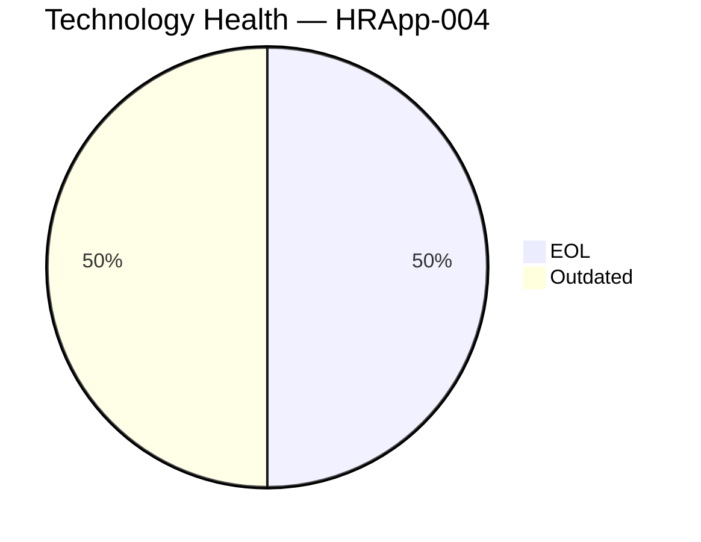
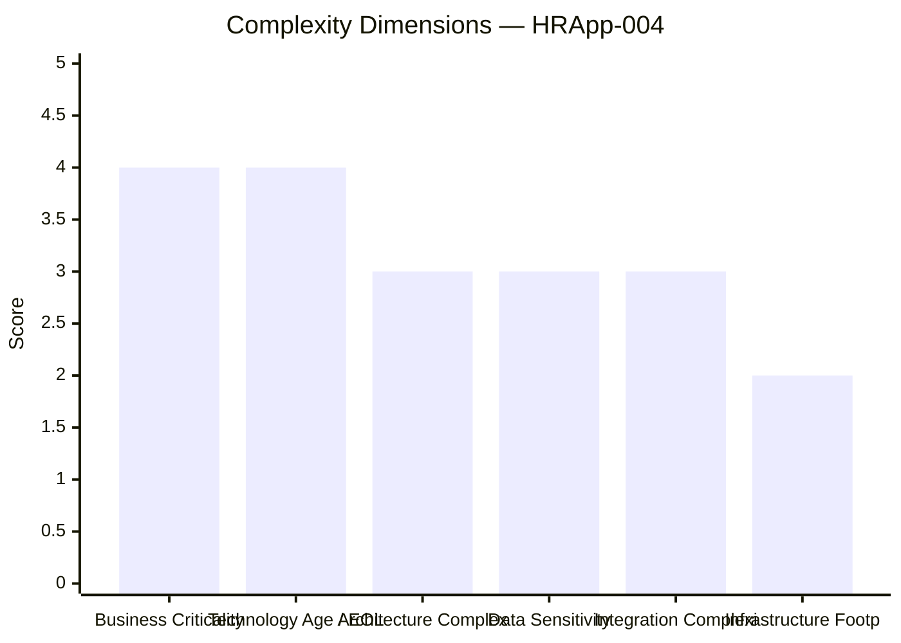
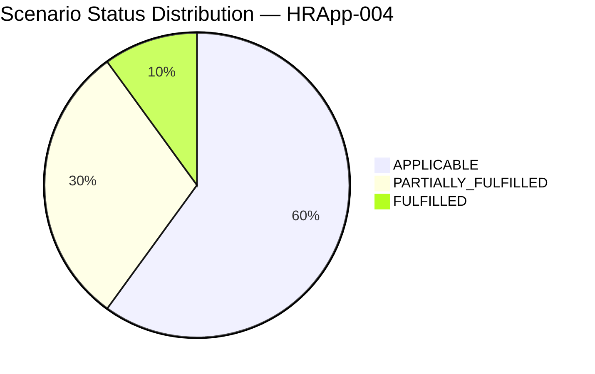

# Application Report — HRApp-004 (APP004)

> **Generated:** 2026-07-30 | **GenDiscover Portfolio Modernization Assessment**

## Overview

| Attribute | Value |
|-----------|-------|
| **Application ID** | app004 |
| **Application Name** | HRApp-004 |
| **Description** | Human resources management system handling employee records, benefits, and HR workflows |
| **Solution Type** | Custom made |
| **Business Criticality** | High |
| **Application Status** | Production |
| **Deployment Type** | AWS, On-premise |
| **Business Unit** | HR |
| **Data Classification** | Internal |
| **Number of Users** | 670 |
| **Business Capabilities** | Employee Management, Payroll Processing, Benefits Administration |
| **Is Containerized** | Yes |
| **CI/CD Present** | Yes |
| **Operating System** | Windows Server 2012 |
| **Programming Language** | .NET Core |
| **Application Server** | Microsoft IIS 8.0 |
| **Database Engine** | SQL Server 2019 |
| **DB License Required** | Yes |
| **Architecture** | 2-Tier |
| **API Endpoints** | 12 |
| **External Interfaces** | 6 |

## Technology Assessment

⚠️ **EOL components detected** | ⚠️ **Outdated components detected**

| Component | Type | Version | Status | EOL Date | Reasoning |
|-----------|------|---------|--------|----------|-----------|
| Windows Server 2012 | os | 2012 | 🔴 EOL | 2023-10-10 | Windows Server 2012 and 2012 R2 reached End of Extended Support on October 10, 2… |
| .NET Core | programming_language | unknown | 🟡 Outdated | N/A | '.NET Core' without a specific version number is ambiguous. .NET Core 3.1 (last … |
| Microsoft IIS 8.0 | application_server | 8.0 | 🔴 EOL | 2023-10-10 | IIS 8.0 is bundled with Windows Server 2012, which reached EOL on October 10, 20… |
| SQL Server 2019 | database | 2019 | 🟡 Outdated | 2030-01-09 | SQL Server 2019 mainstream support ended January 9, 2025. Extended support conti… |

## Complexity Assessment

**Complexity Score: 7/10 — High**

### Key Risk Factors

- Windows Server 2012 EOL — no security patches since Oct 2023
- IIS 8.0 EOL — bundled with EOL OS
- .NET Core version ambiguity — could be EOL (.NET Core 3.1) or current
- SQL Server 2019 in extended support — plan upgrade to SQL Server 2022
- Hybrid deployment adds migration complexity
- HR/payroll data requires careful compliance during migration

**Modernization Recommendation:** High urgency. Migrate OS from Windows Server 2012 to Windows Server 2022 or adopt Linux where applicable. Clarify .NET version and upgrade if needed. Migrate SQL Server to 2022 or managed Azure SQL. Consolidate hybrid deployment.

## Scenario Applicability

| Scenario | Status | Priority | Reasoning |
|----------|--------|----------|-----------|
| Operating System Update | 🔴 APPLICABLE | High | Windows Server 2012 is EOL (October 2023). Security patches require paid Extended Security… |
| Switch to standard Linux Operating System | 🟡 PARTIALLY_FULFILLED | Medium | Application uses .NET Core which supports Linux. Migrating from Windows Server to Linux (R… |
| Switch to ARM-based CPU | 🟡 PARTIALLY_FULFILLED | Medium | .NET Core supports ARM64. Application is containerized. However, Windows Server 2012 (EOL)… |
| Applications Server replacement | 🔴 APPLICABLE | High | Microsoft IIS 8.0 is EOL (tied to Windows Server 2012 EOL October 2023). The IIS version m… |
| Application Migration to Cloud Infrastructure (Lift & Shift) | 🟡 PARTIALLY_FULFILLED | Low | Application is partially cloud-deployed (AWS + On-premise hybrid). Cloud migration is unde… |
| Application Containerization | ✅ FULFILLED | N/A | Application is already containerized (is_containerized = Yes).… |
| Application Refactoring and De-coupling | 🔴 APPLICABLE | Medium | 2-Tier architecture with 12 API endpoints and 6 external interfaces. Custom-made applicati… |
| Upgrade Legacy Databases | 🔴 APPLICABLE | Medium | SQL Server 2019 has entered extended support (mainstream ended Jan 2025). While not EOL, u… |
| Switch DB Engine to open-source database solution | 🔴 APPLICABLE | Medium | SQL Server 2019 requires a commercial license (DB License required = Yes). Migrating to Po… |
| Update outdated components | 🔴 APPLICABLE | High | Windows Server 2012 and IIS 8.0 are EOL. .NET Core version is unknown (possibly EOL if 3.1… |

## Business Case

| Metric | Value |
|--------|-------|
| Total Migration Cost | $491,820 |
| Annual Savings | $208,900 |
| Net Benefit (3 years) | $134,880 |
| 3-Year ROI | 27.4% |
| Complexity Multiplier | 1.4x |

### Scenario Cost Breakdown

| Scenario | Migration Cost | Yearly Savings | 3yr Net Benefit |
|----------|---------------|----------------|-----------------|
| os_update_security_patch | $1,400 | $500 | $100 |
| switch_to_standard_linux_os | $420 | $400 | $780 |
| switch_to_arm_cpu | $7,000 | $1,000 | $-4,000 |
| application_server_replacement | $14,000 | $12,000 | $22,000 |
| app_refactor_decoupling | $350,000 | $150,000 | $100,000 |
| upgrade_legacy_databases | $14,000 | $10,000 | $16,000 |
| switch_db_engine_open_source | $35,000 | $15,000 | $10,000 |
| update_outdated_components | $70,000 | $20,000 | $-10,000 |

---
*Report generated by GenDiscover | 2026-07-30*