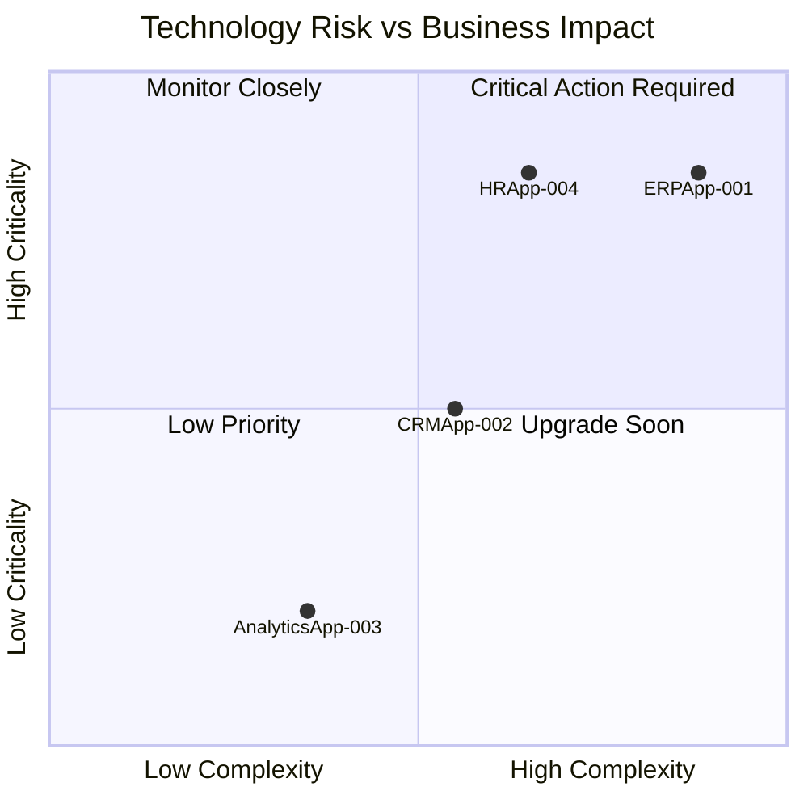
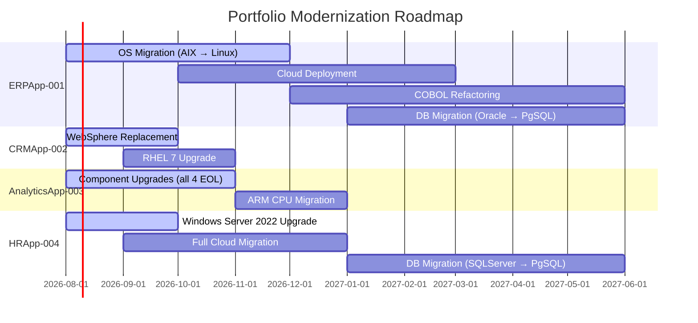
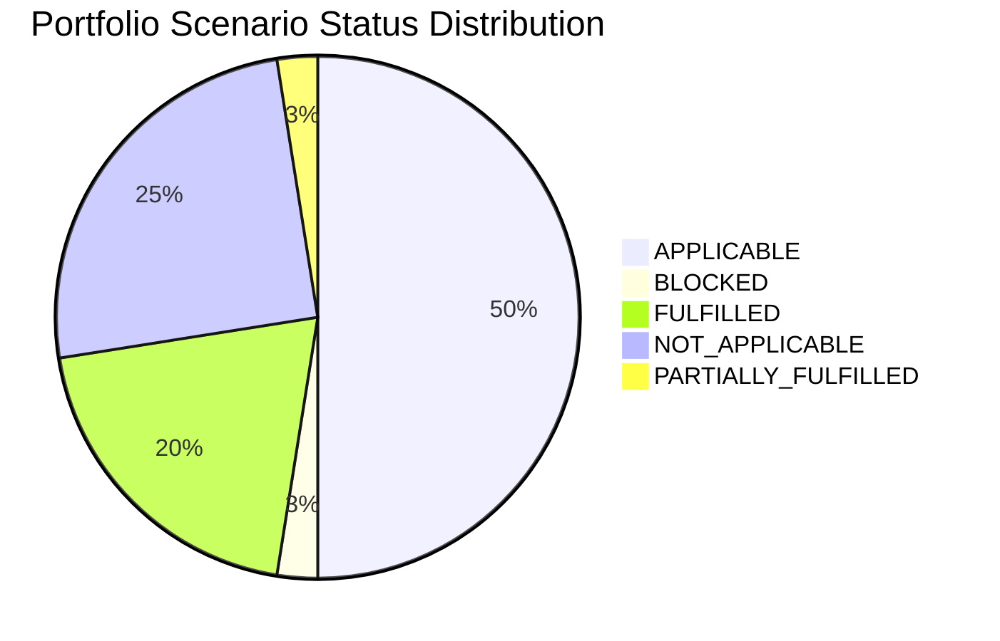

# Portfolio Modernization Report

> **Analysis Date:** 2026-07-21 | **Total Applications:** 5 (4 In-Scope) | **Generated by GenDiscover**

---

## Executive Summary

This portfolio modernization assessment covers **5 applications** across the Finance, Marketing, IT, and HR business units. Of these, **4 applications are in-scope** for modernization analysis; **1 application (EComApp-005)** is retired and excluded.

The portfolio exhibits significant technology debt, with **all 4 in-scope applications** running at least one EOL technology component. The most critical risk is concentrated in ERPApp-001, which runs on the proprietary EOL AIX 7.2 platform with a COBOL-2014 codebase and no CI/CD pipeline — representing the highest modernization complexity in the portfolio.

| Metric | Value |
|---|---|
| Total In-Scope Applications | 4 |
| Applications with EOL Components | 4 (100%) |
| Total Upfront Investment Required | $1,083,100 |
| Total Annual Savings Potential | $405,400/yr |
| 3-Year Portfolio ROI | 12.3% |
| 5-Year Portfolio ROI | 87.1% |

---

## Portfolio Health Overview

| Application | Criticality | Complexity | EOL Components | Containerized | CI/CD | Cloud |
|---|---|---|---|---|---|---|
| **ERPApp-001** | High | 9/10 — Very High | 1 EOL | No | No | ❌ On-Prem |
| **CRMApp-002** | Medium | 6/10 — Medium-High | 2 EOL | No | Yes | ✅ |
| **AnalyticsApp-003** | Low | 4/10 — Medium | 4 EOL | Yes | Yes | ✅ |
| **HRApp-004** | High | 7/10 — High | 2 EOL | Yes | Yes | 🔶 Hybrid |

---

## Technology Risk Heat Map

---

## Applications Summary

### ERPApp-001 (`app001`)

- **Solution Type:** Custom made | **Deployment:** On-Premise
- **Complexity:** 9/10 — Very High
- **Investment:** $582,600 upfront | $178,900/yr savings | ROI 5yr: 53.5%
- **Key Actions:** Os Update Security Patch, Switch To Standard Linux Os, App Deployment To Cloud, App Refactor Decoupling, Upgrade Legacy Databases, Switch Db Engine Open Source, Update Outdated Components

### CRMApp-002 (`app002`)

- **Solution Type:** 3rd party software | **Deployment:** AWS
- **Complexity:** 6/10 — Medium-High
- **Investment:** $16,500 upfront | $12,500/yr savings | ROI 5yr: 278.8%
- **Key Actions:** Os Update Security Patch, Application Server Replacement

### AnalyticsApp-003 (`app003`)

- **Solution Type:** Open Source | **Deployment:** AWS
- **Complexity:** 4/10 — Medium
- **Investment:** $32,500 upfront | $23,500/yr savings | ROI 5yr: 261.5%
- **Key Actions:** Os Update Security Patch, Switch To Arm Cpu, Application Server Replacement, Upgrade Legacy Databases, Update Outdated Components

### HRApp-004 (`app004`)

- **Solution Type:** Custom made | **Deployment:** AWS, On-premise
- **Complexity:** 7/10 — High
- **Investment:** $451,500 upfront | $190,500/yr savings | ROI 5yr: 111.0%
- **Key Actions:** Os Update Security Patch, Application Server Replacement, App Deployment To Cloud, App Refactor Decoupling, Upgrade Legacy Databases, Switch Db Engine Open Source, Update Outdated Components

---

## Scenario Overview

| Scenario | app001 | app002 | app003 | app004 |
|---|---|---|---|---|
| Os Update Security Patch | 🔴 APPLICABLE | 🔴 APPLICABLE | 🔴 APPLICABLE | 🔴 APPLICABLE |
| Switch To Standard Linux Os | 🔴 APPLICABLE | ✅ FULFILLED | ✅ FULFILLED | ⬜ NOT_APPLICABLE |
| Switch To Arm Cpu | ⬜ NOT_APPLICABLE | ⬜ NOT_APPLICABLE | 🔴 APPLICABLE | ⛔ BLOCKED |
| Application Server Replacement | ⬜ NOT_APPLICABLE | 🔴 APPLICABLE | 🔴 APPLICABLE | 🔴 APPLICABLE |
| App Deployment To Cloud | 🔴 APPLICABLE | ✅ FULFILLED | ✅ FULFILLED | 🔶 PARTIALLY_FULFILLED |
| App Containerization | ⬜ NOT_APPLICABLE | ⬜ NOT_APPLICABLE | ✅ FULFILLED | ✅ FULFILLED |
| App Refactor Decoupling | 🔴 APPLICABLE | ⬜ NOT_APPLICABLE | ⬜ NOT_APPLICABLE | 🔴 APPLICABLE |
| Upgrade Legacy Databases | 🔴 APPLICABLE | ⬜ NOT_APPLICABLE | 🔴 APPLICABLE | 🔴 APPLICABLE |
| Switch Db Engine Open Source | 🔴 APPLICABLE | ✅ FULFILLED | ✅ FULFILLED | 🔴 APPLICABLE |
| Update Outdated Components | 🔴 APPLICABLE | ⬜ NOT_APPLICABLE | 🔴 APPLICABLE | 🔴 APPLICABLE |

### Legend
- ✅ FULFILLED — Scenario already satisfied
- 🔶 PARTIALLY_FULFILLED — Partially addressed, action required
- 🔴 APPLICABLE — Action recommended
- ⛔ BLOCKED — Cannot proceed without prerequisite
- ⬜ NOT_APPLICABLE — Does not apply to this application

---

## Business Case Summary

| Application | Investment | Annual Savings | ROI 3yr | ROI 5yr |
|---|---|---|---|---|
| **ERPApp-001** | $582,600 | $178,900/yr | -7.9% | 53.5% |
| **CRMApp-002** | $16,500 | $12,500/yr | 127.3% | 278.8% |
| **AnalyticsApp-003** | $32,500 | $23,500/yr | 116.9% | 261.5% |
| **HRApp-004** | $451,500 | $190,500/yr | 26.6% | 111.0% |
| **PORTFOLIO TOTAL** | **$1,083,100** | **$405,400/yr** | **12.3%** | **87.1%** |

---

## Modernization Priorities

### Priority 1 — Critical (Immediate Action Required)

1. **ERPApp-001:** AIX 7.2 EOL (April 2025) — immediate security risk. Begin OS migration and cloud deployment planning. COBOL refactoring roadmap must be initiated with 2027 decommission target.
2. **HRApp-004:** Windows Server 2012 EOL (October 2023) — High criticality HR system exposed to security vulnerabilities. Upgrade OS and IIS urgently.
3. **CRMApp-002:** WebSphere 7.0 is 10+ years past EOL. Coordinate with vendor for immediate application server upgrade.

### Priority 2 — High (Plan within 6 months)

4. **AnalyticsApp-003:** Python 3.9 EOL, Tomcat 6.1 EOL (9+ years), PostgreSQL 13 EOL — multiple critical component upgrades needed. Low criticality reduces urgency, but containerized nature makes upgrades achievable.
5. **HRApp-004:** Complete cloud migration (eliminate hybrid on-premise component), refactor 2-Tier architecture, migrate from SQL Server to PostgreSQL.

### Priority 3 — Medium (Plan within 12 months)

6. **ERPApp-001:** Oracle 19c Extended Support expires 2027 — plan switch to PostgreSQL for cost savings.
7. **app002:** RHEL 7 upgrade to RHEL 8/9.
8. **app003:** ARM CPU migration (AWS Graviton) for compute cost savings.

---

## Modernization Roadmap Proposal

---

## Scenario Status Distribution (Portfolio)

---

_Report generated: 2026-07-21 | Analysis by GenDiscover_
