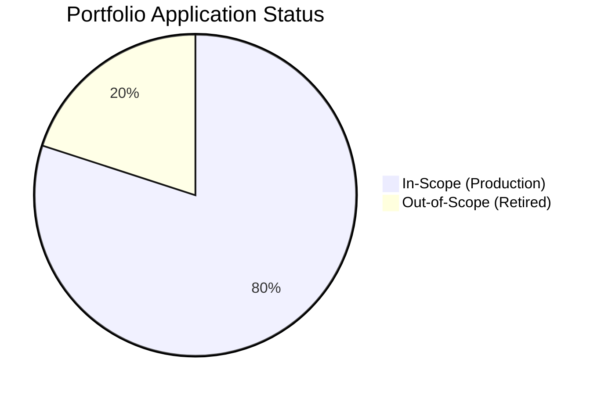
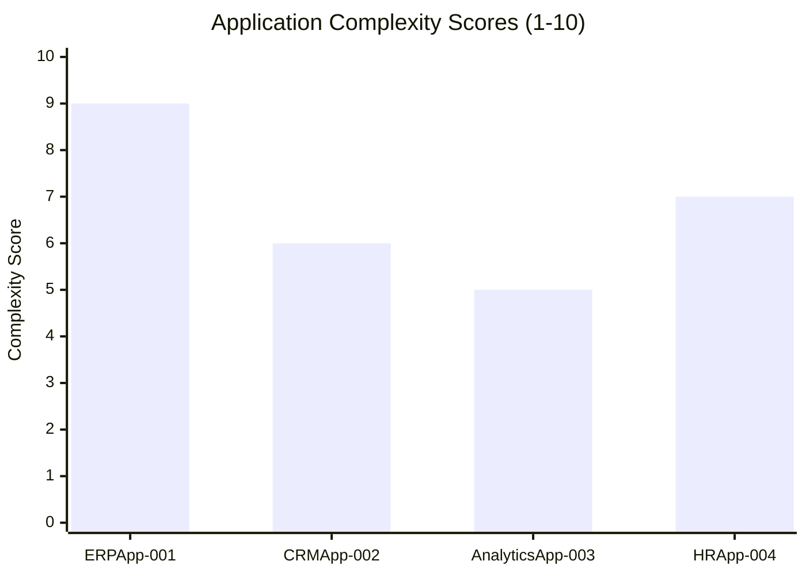
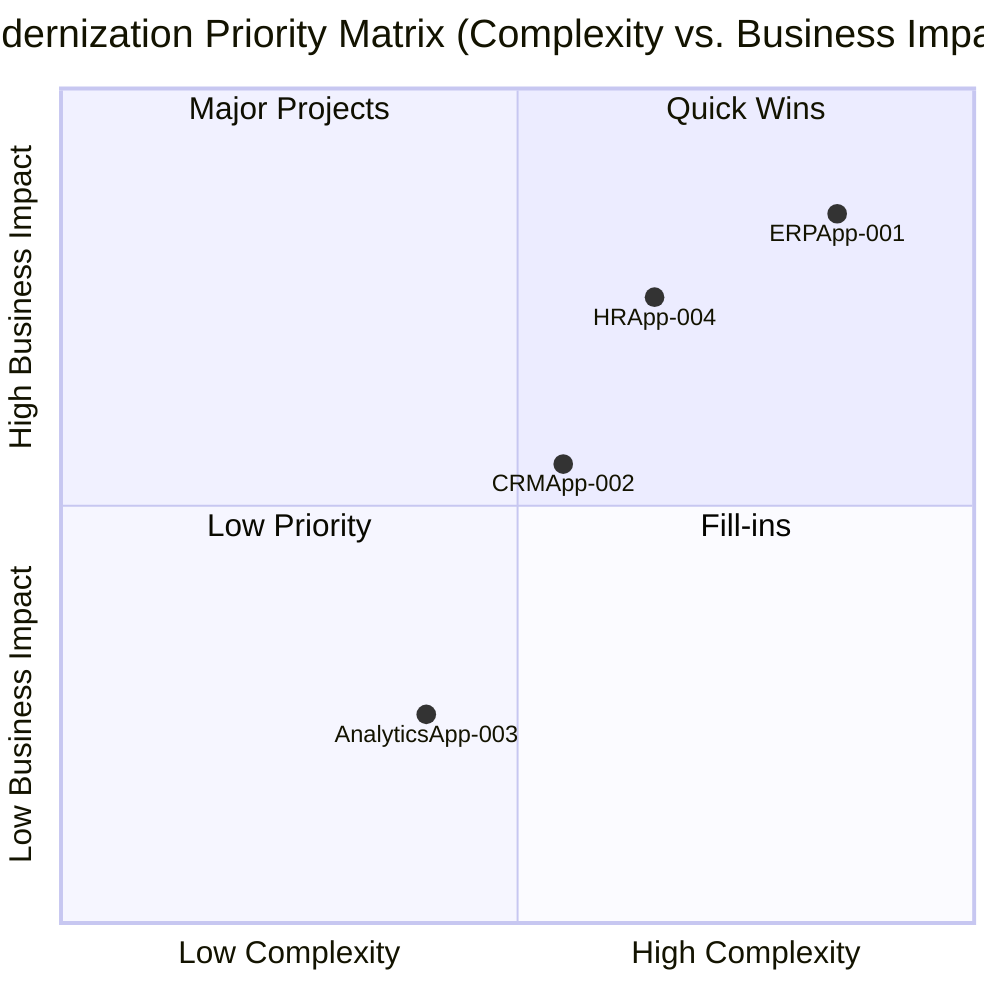
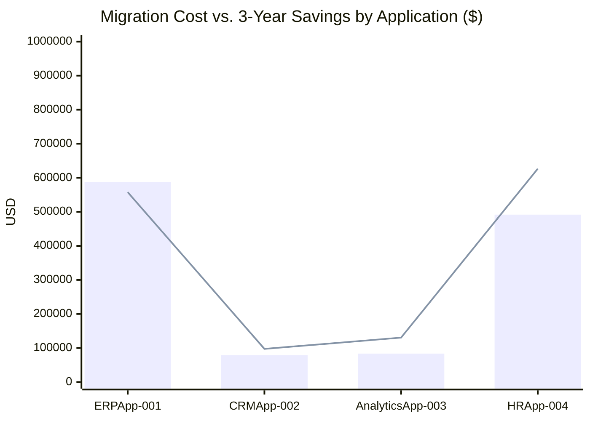
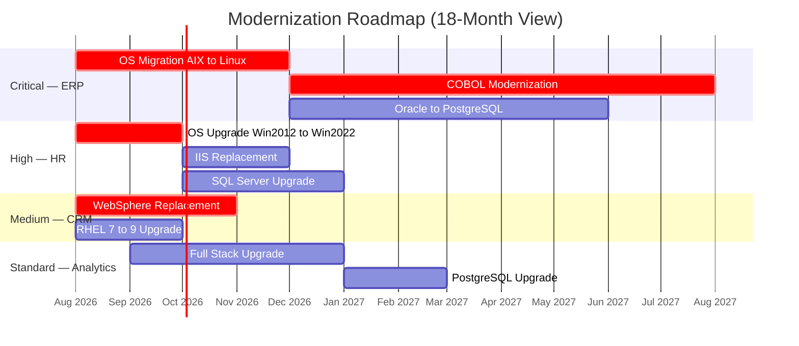

# Portfolio Modernization Report

> **Generated:** 2026-07-30 | **GenDiscover** | Powered by Capgemini GenSuite

## Executive Summary

This report presents a comprehensive modernization assessment of **4 in-scope applications** from a portfolio of **5 total applications**. One application (EComApp-005) has been excluded as it is already **Retired**.

### Portfolio at a Glance

| Metric | Value |
|--------|-------|
| Total Applications | 5 |
| In-Scope Applications | 4 |
| Out-of-Scope (Retired/SAP) | 1 |
| Applications with EOL Components | 4 / 4 |
| Total Migration Investment | $1,242,060 |
| Annual Savings Potential | $470,800 |
| Net Benefit (3 Years) | $170,340 |
| 3-Year Portfolio ROI | 13.7% |

```mermaid
pie title Portfolio Application Status
    "In-Scope (Production)" : 4
    "Out-of-Scope (Retired)" : 1
```

## Application Inventory

| App ID | Name | Criticality | Status | Deployment | OS | DB | Complexity |
|--------|------|-------------|--------|------------|----|----|------------|
| app001 | ERPApp-001 | High | Production | On-Premise | AIX 7.2 | Oracle 19c | 9/10 |
| app002 | CRMApp-002 | Medium | Production | AWS | RHEL 7 | Amazon RDS MySQL | 6/10 |
| app003 | AnalyticsApp-003 | Low | Production | AWS | RHEL 7 | PostgreSQL 13 | 5/10 |
| app004 | HRApp-004 | High | Production | AWS, On-premise | Windows Server 2012 | SQL Server 2019 | 7/10 |
| app005 | EComApp-005 | Critical | **Retired** | AWS | Windows Server 2012 | Amazon RDS MySQL | _Out of Scope_ |

## Technology Health Overview

```mermaid
bar
    title EOL / Outdated Component Counts per Application
    x-axis [ERPApp-001, CRMApp-002, AnalyticsApp-003, HRApp-004]
    y-axis "Component Count" 0 --> 4
```

| Application | EOL Components | Outdated Components | Total Components |
|-------------|---------------|---------------------|------------------|
| ERPApp-001 | 🔴 1 | 🟡 1 | 3 |
| CRMApp-002 | 🔴 2 | 🟡 1 | 4 |
| AnalyticsApp-003 | 🔴 4 | 🟡 0 | 4 |
| HRApp-004 | 🔴 2 | 🟡 2 | 4 |

> **Key Finding:** All 4 in-scope applications have at least one EOL component, indicating a portfolio-wide technology debt risk.

## Complexity Distribution

```mermaid
xychart-beta
    title "Application Complexity Scores (1-10)"
    x-axis ["ERPApp-001", "CRMApp-002", "AnalyticsApp-003", "HRApp-004"]
    y-axis "Complexity Score" 0 --> 10
    bar [9, 6, 5, 7]
```

## Modernization Opportunities

```mermaid
quadrantChart
    title Modernization Priority Matrix (Complexity vs. Business Impact)
    x-axis Low Complexity --> High Complexity
    y-axis Low Business Impact --> High Business Impact
    quadrant-1 Quick Wins
    quadrant-2 Major Projects
    quadrant-3 Low Priority
    quadrant-4 Fill-ins
    ERPApp-001: [0.85, 0.85]
    CRMApp-002: [0.55, 0.55]
    AnalyticsApp-003: [0.40, 0.25]
    HRApp-004: [0.65, 0.75]
```

## Scenario Applicability Summary

| Scenario | ERPApp-001 | CRMApp-002 | AnalyticsApp-003 | HRApp-004 |
|----------|-----------|-----------|-----------------|----------|
| Os Update Security Patch | 🔴 APPLICABLE | 🔴 APPLICABLE | 🔴 APPLICABLE | 🔴 APPLICABLE |
| Switch To Standard Linux Os | 🔴 APPLICABLE | ✅ FULFILLED | ✅ FULFILLED | 🟡 PARTIALLY_FULFILLED |
| Switch To Arm Cpu | 🚫 BLOCKED | 🚫 BLOCKED | 🔴 APPLICABLE | 🟡 PARTIALLY_FULFILLED |
| Application Server Replacement | ⚫ NOT_APPLICABLE | 🔴 APPLICABLE | 🔴 APPLICABLE | 🔴 APPLICABLE |
| App Deployment To Cloud | 🚫 BLOCKED | ✅ FULFILLED | ✅ FULFILLED | 🟡 PARTIALLY_FULFILLED |
| App Containerization | 🚫 BLOCKED | ⚫ NOT_APPLICABLE | ✅ FULFILLED | ✅ FULFILLED |
| App Refactor Decoupling | 🔴 APPLICABLE | ⚫ NOT_APPLICABLE | 🟡 PARTIALLY_FULFILLED | 🔴 APPLICABLE |
| Upgrade Legacy Databases | ✅ FULFILLED | ✅ FULFILLED | 🔴 APPLICABLE | 🔴 APPLICABLE |
| Switch Db Engine Open Source | 🔴 APPLICABLE | ✅ FULFILLED | ✅ FULFILLED | 🔴 APPLICABLE |
| Update Outdated Components | 🔴 APPLICABLE | 🔴 APPLICABLE | 🔴 APPLICABLE | 🔴 APPLICABLE |

**Legend:** ✅ FULFILLED | 🟡 PARTIALLY_FULFILLED | 🔴 APPLICABLE | 🚫 BLOCKED | ⚫ NOT_APPLICABLE

## Business Case Summary

```mermaid
xychart-beta
    title "Migration Cost vs. 3-Year Savings by Application ($)"
    x-axis ["ERPApp-001", "CRMApp-002", "AnalyticsApp-003", "HRApp-004"]
    y-axis "USD" 0 --> 1000000
    bar [587340, 79300, 83600, 491820]
    line [557700, 97500, 130500, 626700]
```

| Application | Migration Cost | Annual Savings | Net Benefit (3yr) | ROI (3yr) |
|-------------|---------------|----------------|-------------------|-----------|
| ERPApp-001 | $587,340 | $185,900 | $-29,640 | -5.0% |
| CRMApp-002 | $79,300 | $32,500 | $18,200 | 23.0% |
| AnalyticsApp-003 | $83,600 | $43,500 | $46,900 | 56.1% |
| HRApp-004 | $491,820 | $208,900 | $134,880 | 27.4% |
| **Portfolio Total** | **$1,242,060** | **$470,800** | **$170,340** | **13.7%** |

## Recommended Modernization Roadmap

```mermaid
gantt
    title Modernization Roadmap (18-Month View)
    dateFormat  YYYY-MM
    axisFormat  %b %Y
    section Critical — ERP
    OS Migration AIX to Linux   :crit, erp1, 2026-08, 4M
    COBOL Modernization          :crit, erp2, after erp1, 8M
    Oracle to PostgreSQL          :erp3, after erp1, 6M
    section High — HR
    OS Upgrade Win2012 to Win2022 :crit, hr1, 2026-08, 2M
    IIS Replacement              :hr2, after hr1, 2M
    SQL Server Upgrade            :hr3, 2026-10, 3M
    section Medium — CRM
    WebSphere Replacement        :crit, crm1, 2026-08, 3M
    RHEL 7 to 9 Upgrade          :crm2, 2026-08, 2M
    section Standard — Analytics
    Full Stack Upgrade           :ana1, 2026-09, 4M
    PostgreSQL Upgrade           :ana2, after ana1, 2M
```

### Phase 1 — Immediate Actions (0–3 months)

- **[app001]** Begin AIX-to-Linux migration planning; assess COBOL-to-Java/Go rewrite scope
- **[app002]** Replace WebSphere 7.0 immediately — decade-old EOL is an active security risk
- **[app004]** Upgrade Windows Server 2012 to Windows Server 2022 (or migrate to Linux)
- **[app003]** Plan full stack upgrade (RHEL 9, Python 3.12, Tomcat 10, PostgreSQL 16)

### Phase 2 — Core Modernization (3–9 months)

- **[app001]** Execute Linux migration; deploy COBOL runtime on RHEL/SLES
- **[app002]** Upgrade OS from RHEL 7 to RHEL 9; coordinate vendor upgrade
- **[app004]** Upgrade SQL Server 2019 → 2022 or migrate to managed Azure SQL
- **[app003]** Execute stack upgrade; leverage existing containerization

### Phase 3 — Strategic Improvements (9–18 months)

- **[app001]** Evaluate Oracle-to-PostgreSQL migration; establish API endpoints for ERP data
- **[app004]** Evaluate SQL Server-to-PostgreSQL migration; complete cloud consolidation
- **[app003]** Migrate to ARM (AWS Graviton) for cost/energy savings
- **[app004]** Introduce microservice refactoring for HR/payroll workflows

## Out-of-Scope Applications

| App ID | Name | Status | Reason |
|--------|------|--------|--------|
| app005 | EComApp-005 | Retired | Application already retired; decommission date recorded as 'already retired'. No modernization applicable. |

---
*Report generated by GenDiscover | Powered by Capgemini GenSuite | 2026-07-30*